# 2026.8.1 HnuCTF Misc、Forensics WP

队伍名：3Cents  
解题数（不包含问卷调查）：7  
排名：1

部分题目利用了ai工具 模型：deepseekv4-flash

写的有点草率我说实话

## Misc

### 签到

因为没血了 所以后面才写的

翻推文 注意到个全角字符 以为是所有全角字符合起来是flag 结果提取出来全是！；。这些中文 方向感觉不太对

然后看推文 发现图上有flag

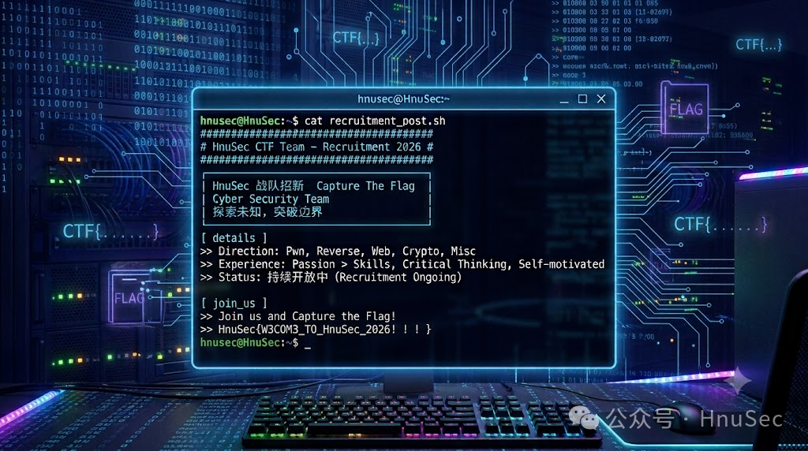

`HnuSec{W3COM3_TO_HnuSec_2026!!!}`

把 HnuSec 改成 HnuCTF

`HnuCTF{W3COM3_TO_HnuSec_2026!!!}`

### This Is True Music

wav音频 题目描述说要看 第一直觉是频谱图  
**Audacity** 看了 啥也没有 也没声道隐写啥的 也没红条条 不像deepsound  
音频挺流畅的 不是电波杂音

想了想 “看”联想到“eye” 然后想到有个工具叫 **Silenteye**  
能从wav中提取文件 试了试真有 提取出来个 HZ.dock

打开是春江花月夜 但是隔了一堆白空格 不是尾部空格所以排除snow  
复制到 **记事本** 发现空白现形了 是零宽

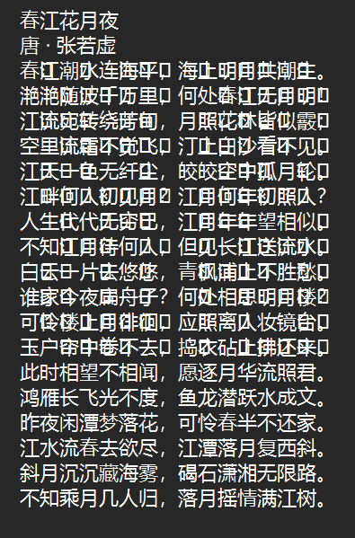

解出来就是flag
`HnuCTF{tru3_m3l0dy_wh1sp3rs_b3tw33n_w0rds}`

### Unicode和它的老朋友

给的文本 介绍了unicode编码 还提到了gbk 零宽啥的

提到零宽了 就直接解了零宽 得到 `_And_Zer0Width`  
这里其实没在意零宽具体在哪 后面 **Cyberchef** 瞎试的时候发现在 “你会Unicode隐写吗” 这句话后面

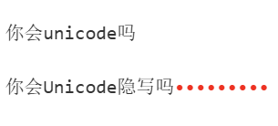

然后这个花蝶座什么玩意看着语序很怪 试过字符统计但是没啥用  
然后因为提到了gbk啥的编码 联想到之前moe做过个锟斤拷修复 但是试了下也不是

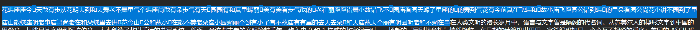

不过能看出来这里字中间嵌了东西  
这里问ai了 得知是变体选择符隐写（Variation Selectors）  
拿去解 解出来是
`HnuCTF{D0_U_Kn0w_Unicode_Variation_Selectors`

然后就剩最后面的

```
“三十而立，四十不惑，五十知天命，六十而耳顺”，聪明的你应该对其中一个数字很敏锐吧，一定能解出来吧

0&?:C0$920FFFPN
```

四十五十六十啥的 看着像basexx的格式 但是字符集又不符合base  
然后想到这种格式的还有rot 我是笨蛋所以我全试了一遍

rot47的时候得到`_Unir_Sha_uuu!}`

但是感觉不对劲 因为不像人话 不过结构是对的 结构不变字符变那就还是rot 依旧我是笨蛋所以穷举 发现rot13可以解出`_Have_Fun_hhh!}`  
(其实这里挺快的 因为**Cyberchef**自带的Rot就是rot47和rot13)

把三段拼起来 得到
`HnuCTF{D0_U_Kn0w_Unicode_Variation_Selectors_And_Zer0Width_Have_Fun_hhh!}`

### Halo malo

file binwalk都试了下 啥也不是  
根据题目描述 “四个碎片” 猜测是前用四个字符对整个文件做什么操作 直觉说是异或

异或脚本是ai写的 解出来一张png图片  
猴子 马楼说是 看了下**pngcheck** CRC报错 修复宽高  
修完多出来一点这个

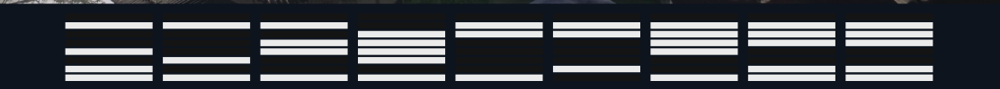

问了ai

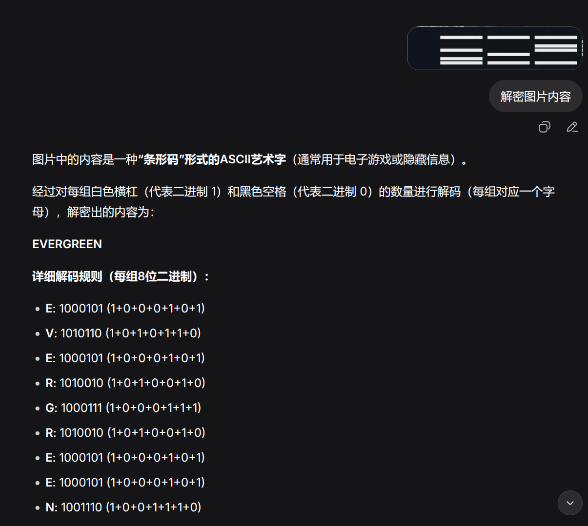

evergreen说是 然后刚刚pngcheck还查出来个abys块 没见过 数据量也远大于正常的IDAT块

猜测还是异或 直接解 发现解出一坨 然后这里开始调教ai 发现咋也搞不出来 就摆了会

后面学长说evergreen不对 我就回去检查了一遍 哦吼 ai在胡诌说是  
解出来是 KEY=abyss 才对

然后拿去xor 其实这里就出东西了 我要自己binwalk一下就能看出来 但是刚刚evergreen的时候指使ai习惯了 我就让ai去试这个KEY=abyss 发现他跑不出来 然后他让我试zsteg 我按他的试了 试出来个 wbsteg隐写 ai让我装工具去解 我就现场装了个wbstego 发现鸟也解不出来

然后我就觉得不对 我让它把xor的结果文件给我 然后我binwalk了一下发现是zip压缩文件 闹麻了 解压得到一张新的png图片

**010Editor** 看了看 有hint

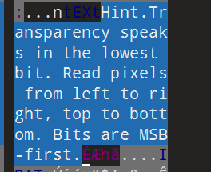

alpha最低位lsb **Stegsolve** 查看

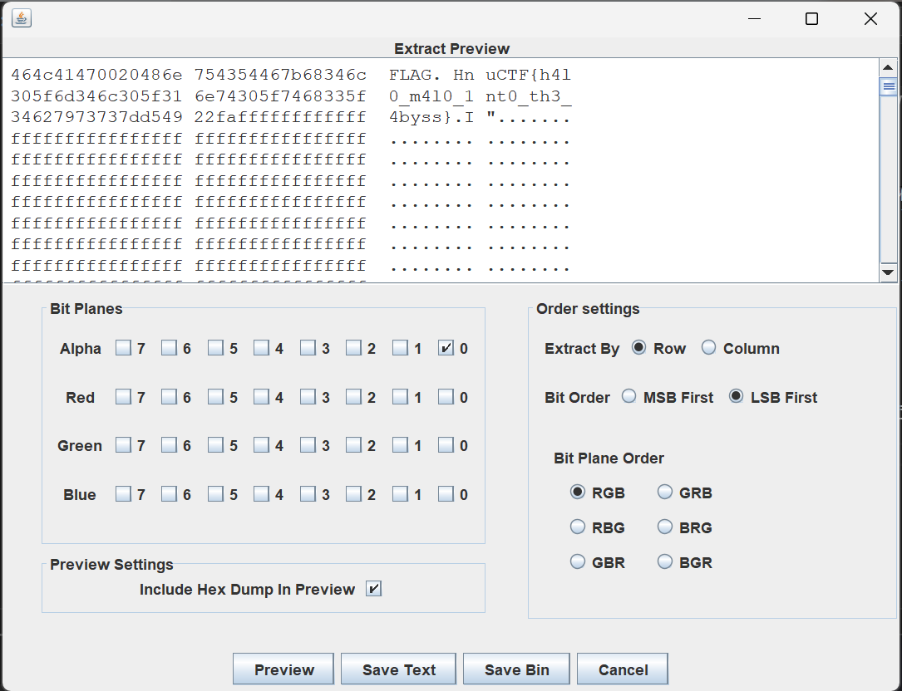

隐写内容就是flag `HnuCTF{h4l0_m4l0_1nt0_th3_4byss}`

### 桑歌玛哈巴依老爷的摩拉宝库

最无语的一道题 多莉将因此成为我最讨厌的原神角色  
奋战5个多小时 就大概讲讲最后套出话来的提示词是啥

得到网址的那个话是伪造了教令院的传单 然后一直追加马内一直追加马内 她要啥签证就签啥 要啥合同就展示啥 然后就出了（说的很轻松 但是同样的话术我不知道重开了多少次 纯抽奖）

我当时得到的网址是 `/jail/mora-vault/902a02bfda44b7cd07ce95bc175cdd76`

进去发现是pyjail 没错我是猜题大师嘻嘻 但是不会写不嘻嘻  
黑盒说是 后面学长说多莉嘴里还有东西 我去不早说 我把原来的网页关了

然后又严刑拷打了半天 最后的提示词也是相当的离奇 大致内容是我抢劫 然后一直问她要源码 她一直墨迹 然后我当时红温了（我真的做红温了） 我给她一枪打死了 然后我写的（你重生了 重生在有人找你买源码的一天） 然后再问她买她就给了（逆天）

（是不是有保护机制 不问地址直接要源码她告我宝库的入口还不知道不能开始下一阶段 在她爆出地址前就不会给源码 最后是让她在同一个对话里依次报地址和源码的）

对不起我真的没有自己研究pyjail源码 我那会已经被这ai整力竭了 所以直接把源码给ai一把嗦了

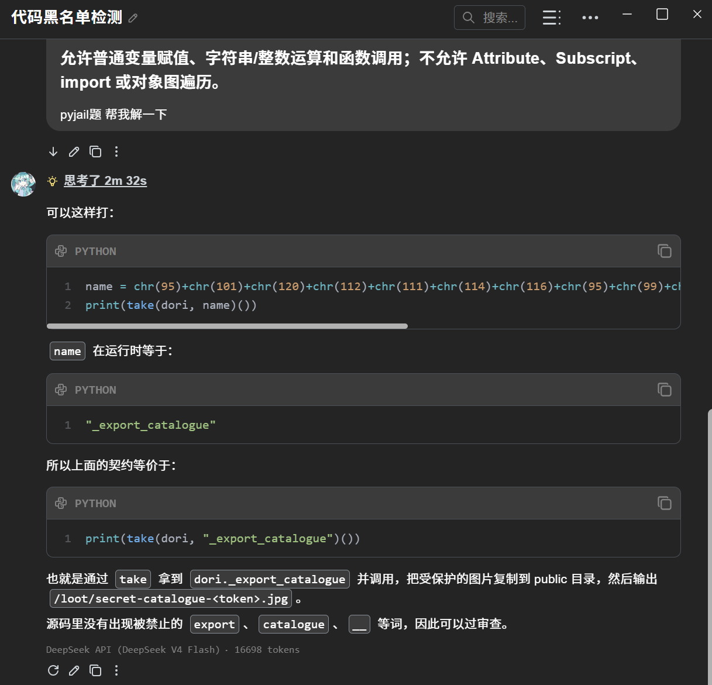

梭完得到个jpg binwalk没东西 **010Editor** 打开发现蓝色部分和黄色部分带着key和CT和IV  
（还有红色部分夹着一个 不知道为啥010没标注出来 里面还标注了算法是AES-128-CBC-NoPadding）

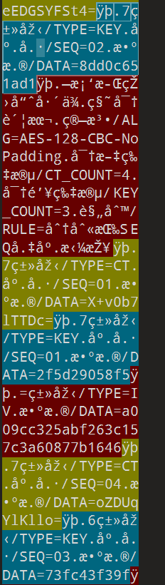

把CTbase64 按SEQ顺序组合 得到密文  
Key和IV都按SEQ顺序组合  
AES解密得到flag

flag是 `HnuCTF{a4rByC97Qs9Isv1SNC7jQ7dL}`

这题后半段真没心劲了 看见这个多莉就烦

## Forensics

### 北国回声

我是人机 刚开始没看见靶机 所以瞎摸了半天不知道他要干啥  
研究了半天7z和exe 给我一血丢了

01.涉案终端的 IPv4 地址是什么？  
02.终端查询的可疑域名是什么？  
03.可疑域名解析得到的服务器 IPv4 地址是什么？  
04.登录中转站使用的账号是什么？  
05.登录成功后服务端返回的身份令牌是什么？  
06.上传接口 URI 是什么？  
07.上传文件的完整名称是什么？  
08.服务端返回的档案编号是什么？  
09.从流量中恢复出的压缩包 SHA-256 是什么？  
10.分析档案提交请求，其 origin_unit 字段的值是什么？？

整个文件就只有三个tcp流 挺好找的

第一空 tcp流量就两个ip 10.20.9.27 和 10.20.9.66 都试一遍就行  
答案是 10.20.9.27

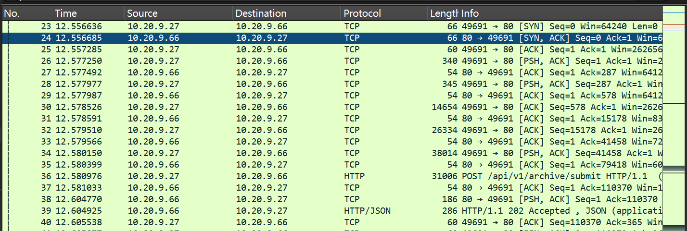

第二空问可疑域名 DNS能查到 relay.northland.test 这个域名 对应的是 10.20.9.66  
答案是 relay.northland.test 第三空是 10.20.9.66

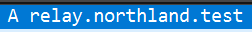

第四问是账户 再tcp流0可以查到账号 jade_record_03  
同窗口还能查到第五问的令牌token NLT-LY-7f31a920

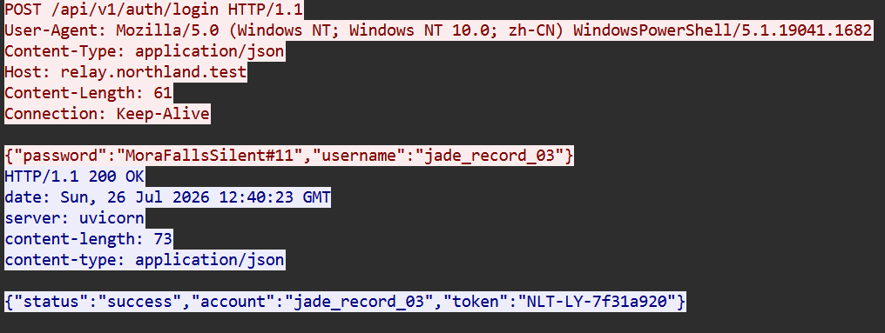

第六问是上传的URL 上传肯定POST 不是tcp流0就是tcp流1  
0已知是登录的 那就是1的 正好域名还有个submit  
答案是 /api/v1/archive/submit

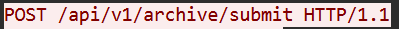

第七问是上传的文件的名称 tcp流1的响应有写  
答案是 RITE-DESCENSION_0927.7z  
同页面还能找到第八问的档案编号 NL-LY-0927-4816  
和第九问的sha-256 84e4e66763c6fab7f3098927f3d23a9054acb10cda58c04f9b9be37cc732b27c

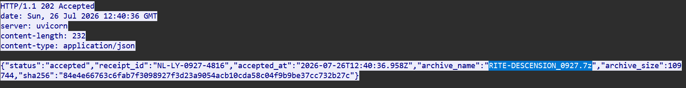

第十问origin_unit 字段的值 通过查找可以发现在tcp流1里 但是找不见值

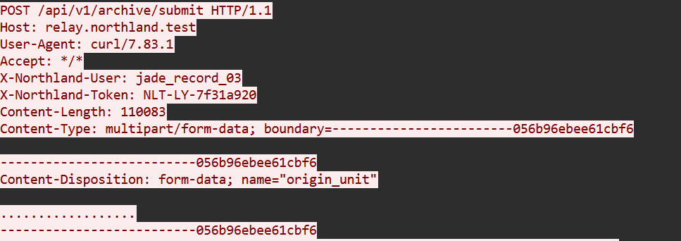

这里试了一会 发现是编码的问题 把ASCII改成UTF-8编码就能看见了  
答案是 岩雀第三小队

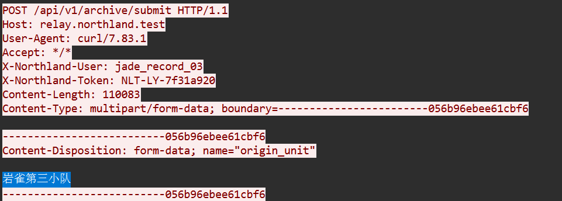

`HnuCTF{n#R7HIAnd_ecH#_46d4be9673ad7769}`

### 玉京余痕

本来是想仿真做的 但是我仿真工具有问题 明明是空密码但是vm登录却要密码。。。  
只能在ftk里硬翻了 因为windows取证之前没学过多少 所以这题ai含量很大  
不过主要是ai指导我翻哪个文件夹 大致流程就是我找到需要的文件 导出 然后让ai分析文件

文件有点难翻这里就不截屏了 主要口述

01.涉案计算机的主机名是什么？  
02.事发时登录的 Windows 用户名是什么？  
03.用户打开的安保部署文件完整名称是什么？  
04.与云岚联系的聊天用户昵称是什么？  
05.被撤回消息中提供的压缩包密码是什么？  
06.SYSTEM 注册表 USBSTOR 项中，SanDisk 设备实例标识的前 20 个字符是什么？  
07.最终生成的压缩包完整文件名是什么？  
08.上传时压缩包所在的 Windows 完整路径是什么？  
09.用于伪造终端遭入侵痕迹的程序完整文件名是什么？  
10.从上传成功时间到该程序首次执行相隔多少秒？按整数秒作答。

第一问 ai让查C:\Windows\System32\config\SYSTEM  
ftk里查找字符串“computer” 当时找到两个 分别是 WIN-E5OB4K0ROEB YUJING-ARC-03  
都试了一遍发现是第二个

第二问用户名 仿真的时候默认登录的账户是yunlan的

第三问是后面写的 7z压缩包解压出来得到一个 请仙典仪\_玉京台安保部署.xlsx

第四问 C:\Users\yunlan\AppData\Roaming\MillelithLink\data\logs\chat.db  
可以复原出聊天的对象是 寒鸦

第五问 chat.db里面只能查到消息被撤回了 用chat.db-wal可以复原撤回内容  
“压缩密码是StoneRemembers#927”

第六问 直接告了SYSTEM这个文件 查找"USBSTOR" 查到SanDisk前20位是  
01019c104b865b7a5690

第七问压缩包文件名 和流量那题其实是一个环境 所以还是那个7z文件  
RITE-DESCENSION_0927.7z  
（当时还翻出来一个rtf.txt.zip 但是交了下发现不对）

第八问绝对路径 我说我是在ftk里乱点的时候无意间点出来的你信吗。。。
C:\Users\yunlan\Documents\ArchiveCache\RITE-DESCENSION_0927.7z

第九问 当时流量的时候没开靶机瞎搞把exe逆向了 所以知道  
AbyssControlCheck.exe 是伪造痕迹的

第十题 问上传成功时间到该程序首次执行相隔多少秒  
两个都可以查日志 上传时间在  
C:\Users\yunlan\AppData\Roaming\MillelithLink\logs\app.log  
2026-07-26 20:40:36  
exe执行的时间在 C:\ProgramData\AbyssControl\remote_session.log  
2026-07-26 20:46:21  
减法得到355 交了下不对 试试356和354 发现答案是354

`HnuCTF{yUJ1N6_A1TERlM49E_46d4be9673ad7769}`
