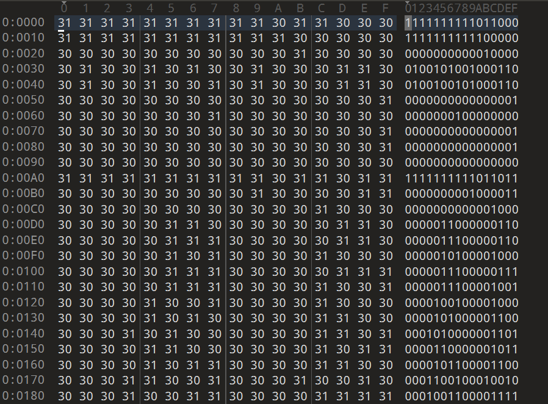
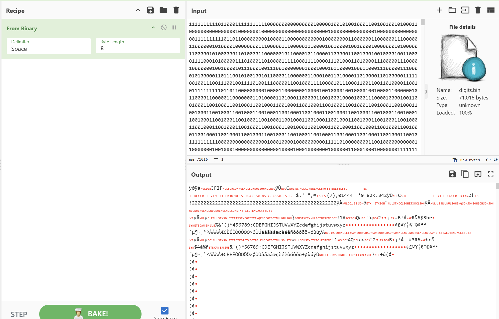
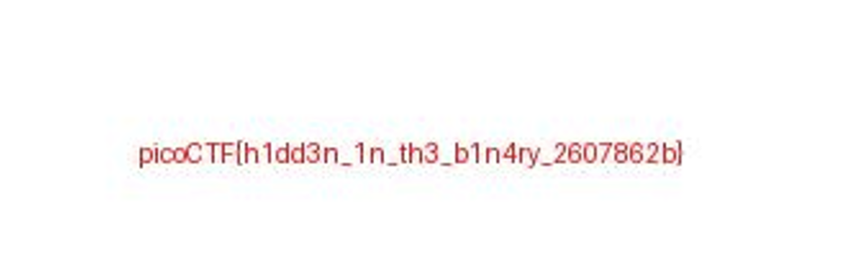

# Binary Digits(二进制数字)

**题目描述**：这个文件看起来没什么大不了的......只是一堆1和0。但也许这不仅仅是随机的噪音。你能从中恢复任何有意义的东西吗?  
**工具**：010Editor Cyberchef

拿到附件 bin文件

bin文件即数据文件 用 **010Editor** 打开

和题目描述说的一样 都是0和1 二进制 用 **Cyberchef** 解密

发现jpg文件头 保存解密结果为文件

打开

取得flag flag为  
`picoCTF{h1dd3n_1n_th3_b1n4ry_2607862b}`
