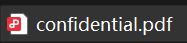
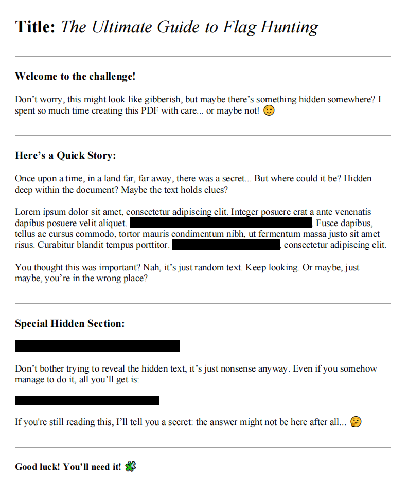
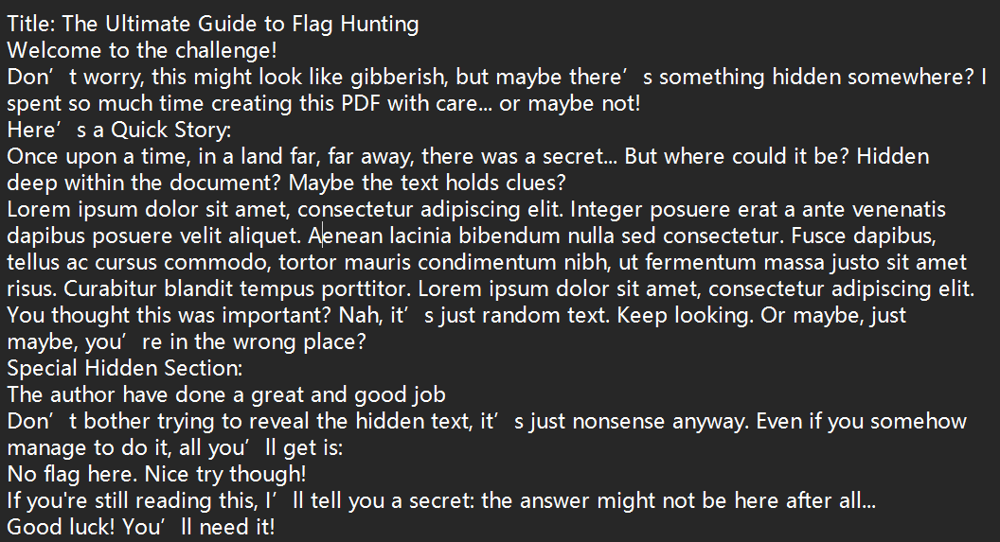
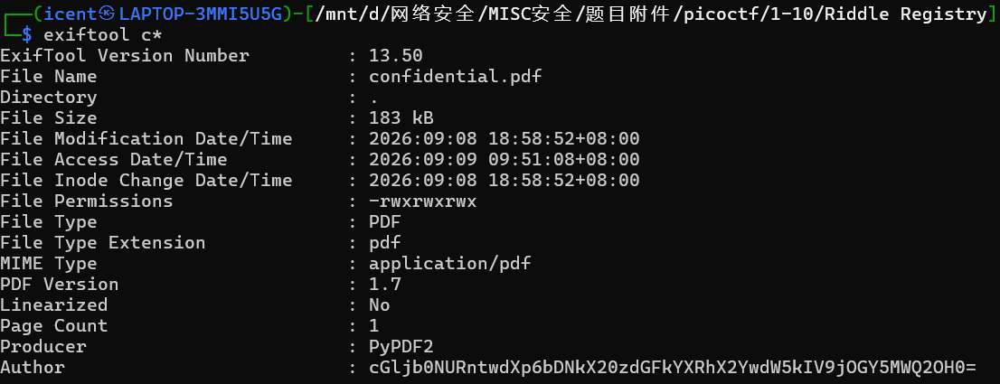
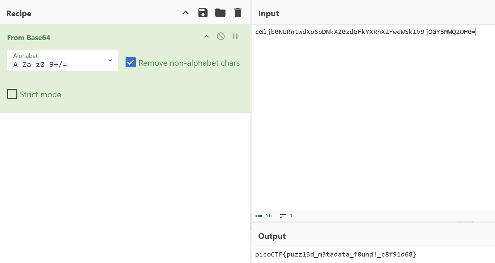

# Riddle Registry(谜语注册表)

**题目描述**：嗨，勇敢的调查者！📄🔍 你偶然发现了一个奇怪的 PDF，里面看似只是一些杂乱的乱码。但要小心！并非一切都如表面所见。在这混乱之中隐藏着一份宝藏——一个难以捉摸的旗帜，等待你去发现。  
**工具**：exiftool Cyberchef

拿到附件 pdf文件

打开

发现有黑色乱码 `Ctrl+a` 全选 写到记事本里

没什么可用的内容 只有hint说 答案藏在这些内容之后  
结合题目“注册表” 猜测要看元数据 试试 **exiftool**

发现 `Author` 有段base64 **Cyberchef** 解密

取得flag flag为  
`picoCTF{puzzl3d_m3tadata_f0und!_c8f91d68}`
