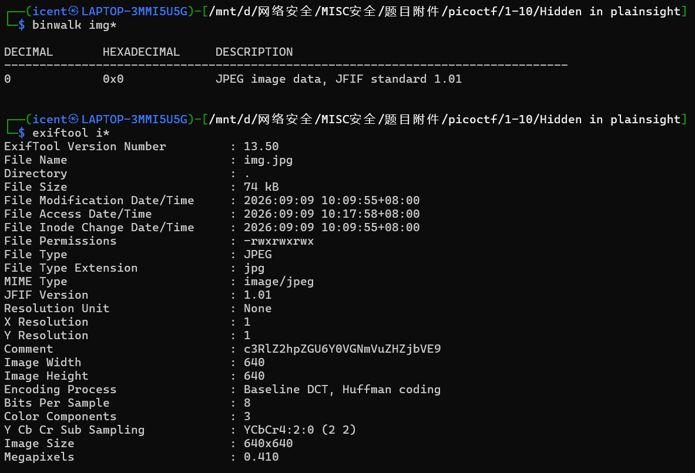
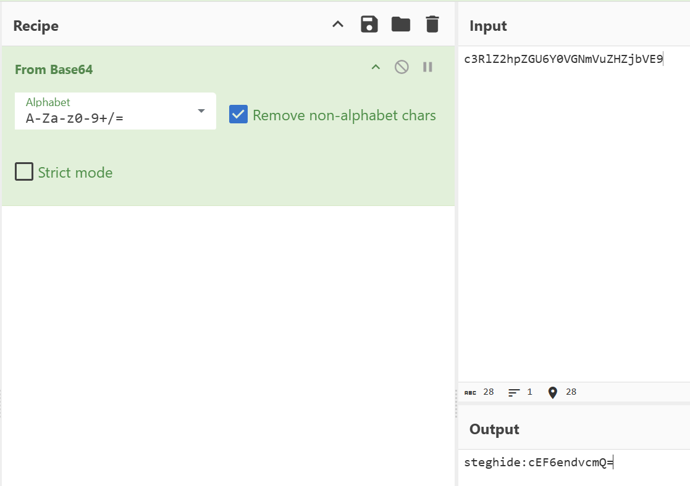
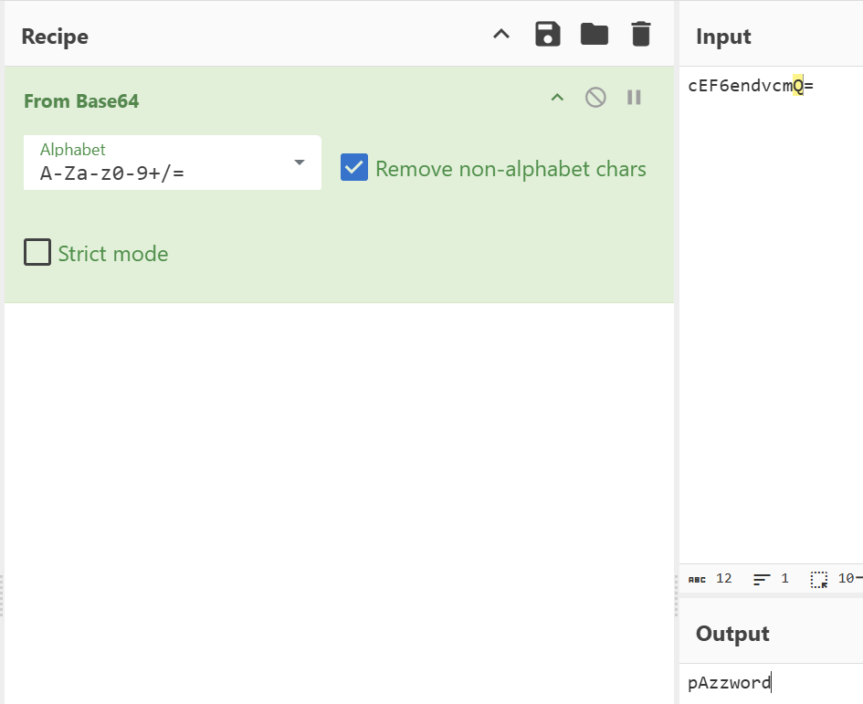
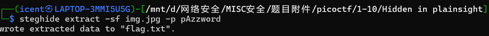
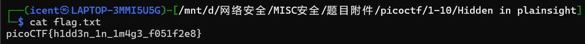

# Hidden in plainsight(隐藏在显眼处)

**题目描述**：你得到了一张看似普通的 JPG 图片。文件里藏着一些看不见的东西。你的任务是发现隐藏的内容并提取旗标。  
**工具**：exiftool Cyberchef steghide

拿到附件 jpg文件

打开图片看看

没什么东西 用 **exiftool** 简单分析一下

发现 `Comment` 有段base64 **Cyberchef** 解密

发现关键词 **steghide** 后面也是base64 再解一下

得到 **steghide** 的密码 提取

得到flag.txt 打开看看

取得flag flag为  
`picoCTF{h1dd3n_1n_1m4g3_f051f2e8}`
