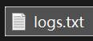
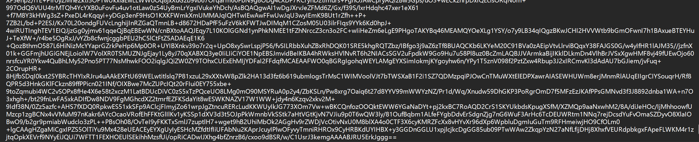
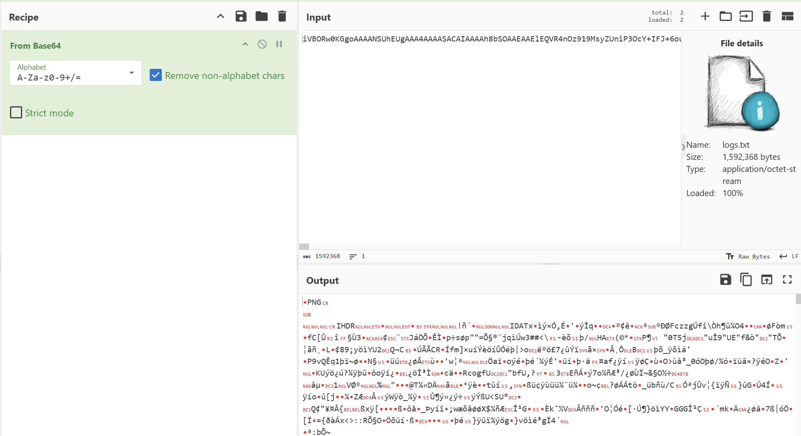
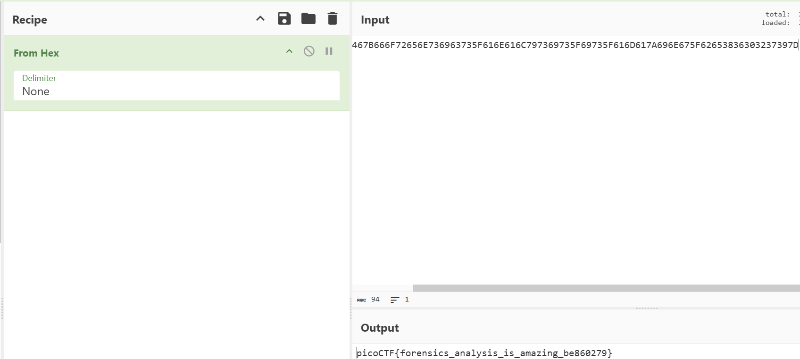

# Flag in Flame(火焰中的旗帜)

**题目描述**：SOC 团队在最近的一次安全漏洞后发现了一个异常大的日志文件。当他们打开它时，发现里面不是普通的日志，而是一大块编码过的文本。里面会隐藏着什么东西吗？你的任务是检查生成的文件，揭示它的真正用途。团队依靠你的技能来挖掘这个不寻常日志中可能隐藏的信息。  
**工具**：Cyberchef

拿到附件 txt文件

打开看看

base64编码 **Cyberchef** 解

发现是png图片 导出

打开

十六进制 解密

取得flag flag为  
`picoCTF{forensics_analysis_is_amazing_be860279}`
