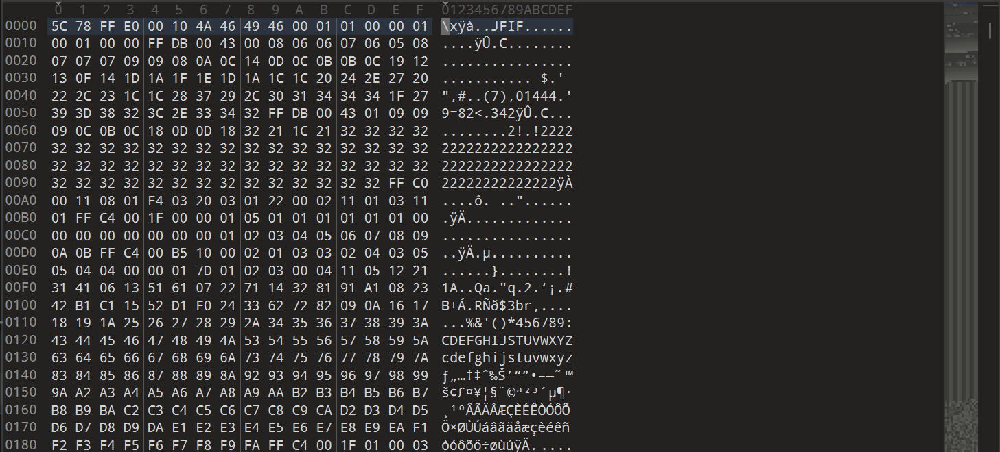
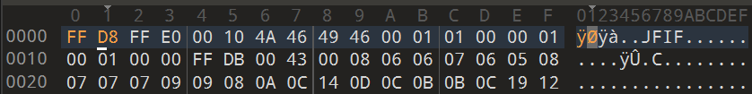

# Corrupted file(文件损坏)

**题目描述**：这个文件看起来坏了……或者不是呢？也许几个字节就能改变一切。你能想办法让它恢复生机吗？  
**工具**：010Editor

拿到附件 不知道什么文件

用 **010Editor** 打开

发现关键词 **JFIF** 可以看出这是一个jpg文件  
jpg文件的开头是 `FF D8 FF E0` 把损坏的文件头改掉就行

保存 并且把后缀改成.jpg

打开

取得flag flag为  
`picoCTF{r3st0r1ng_th3_by73s_939a65f5}`
