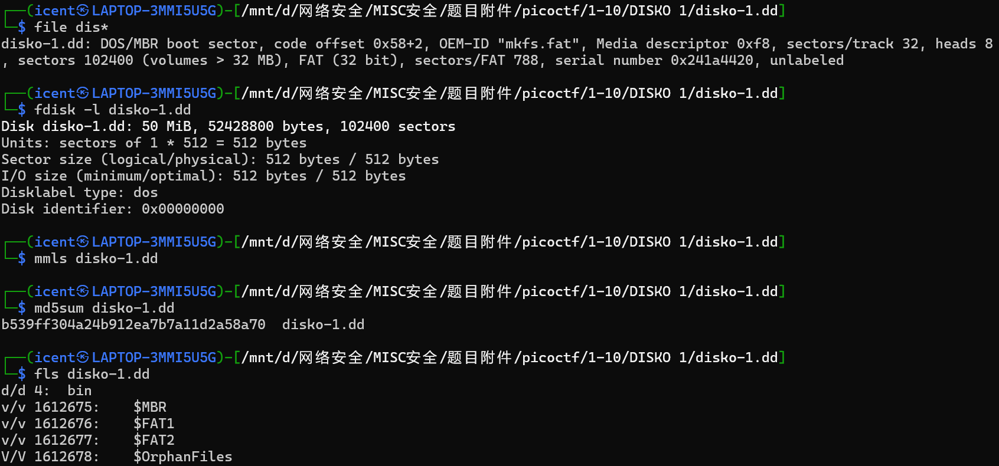
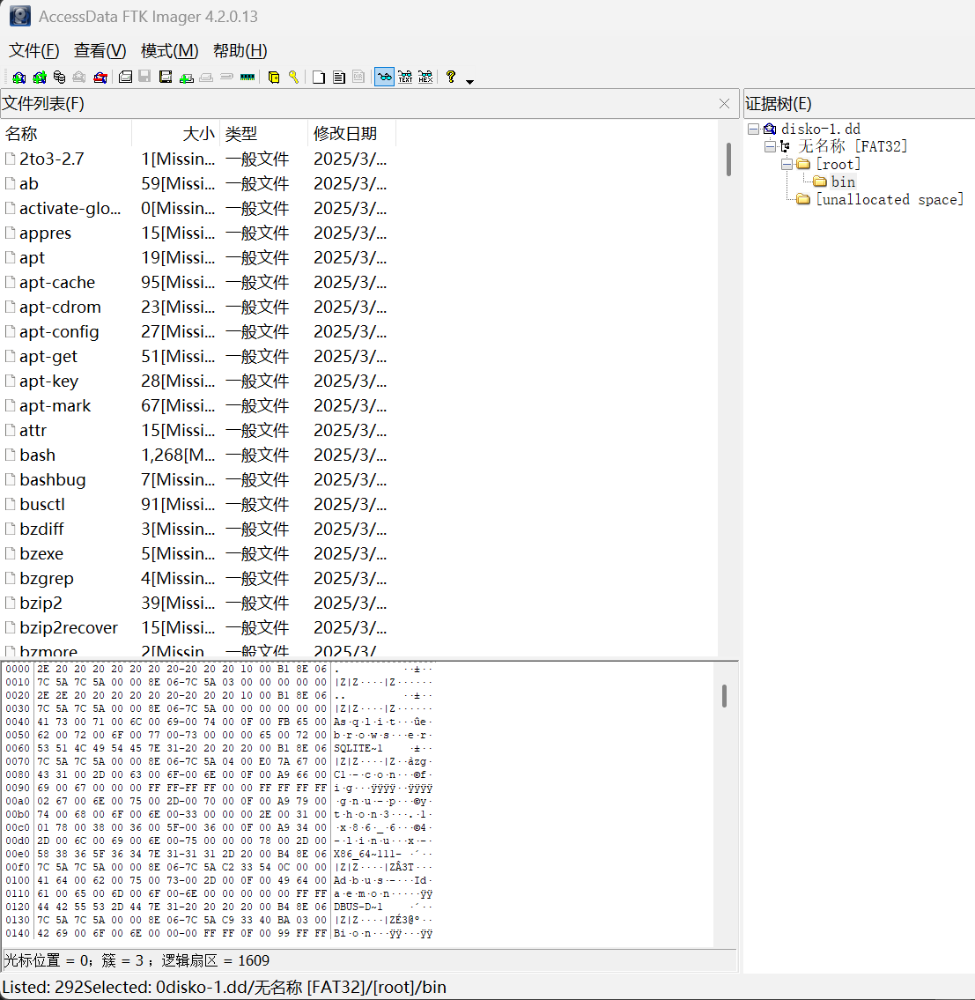
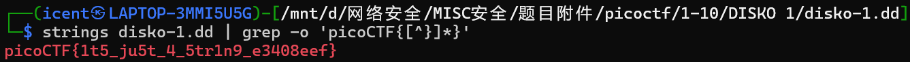

# DISKO 1(磁盘1)

**题目描述**：你能在这个磁盘镜像里找到旗子吗？  
**工具**：FTK-Imager

拿到附件 dd文件

简单看一下结构

dd映像 用 **FTK Imager** 打开试试

发现文件很多 但是没有很直接的flag文件  
试试直接string|grep查找

取得flag flag为  
`picoCTF{1t5_ju5t_4_5tr1n9_e3408eef}`
