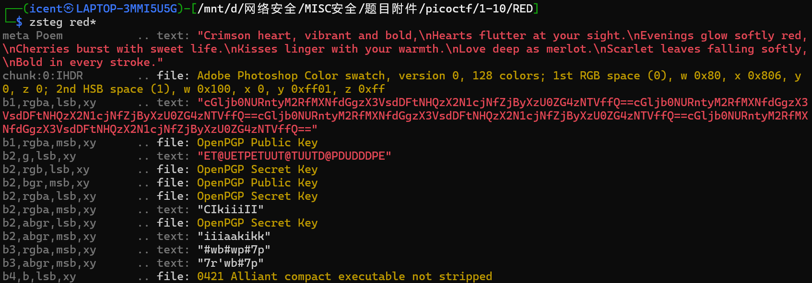
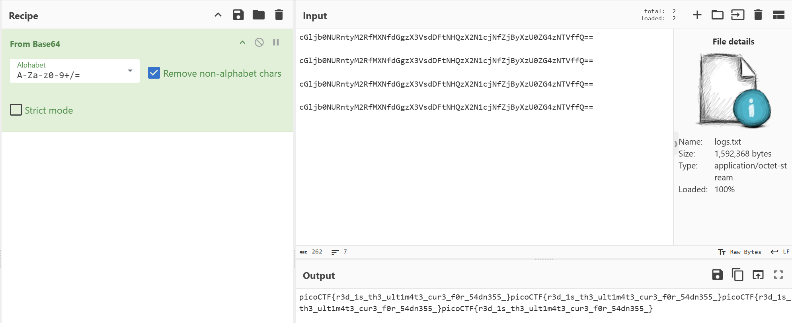

# RED(红色)

**题目描述**：红色，红色，红色，红色  
**工具**：zsteg Cyberchef

拿到附件 png图片

根据题目red和文件格式png 联想到RGB轨道 进而联想到LSB隐写  
使用 **zsteg** 查看

发现有base64 用 **Cyberchef** 解密

取得flag flag为  
`picoCTF{r3d_1s_th3_ult1m4t3_cur3_f0r_54dn355_}`
