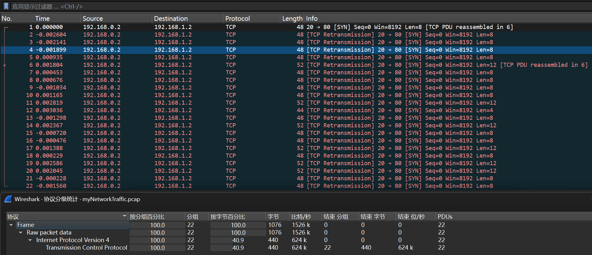
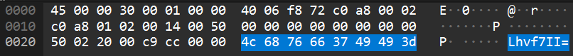
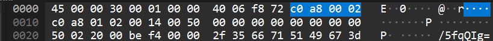
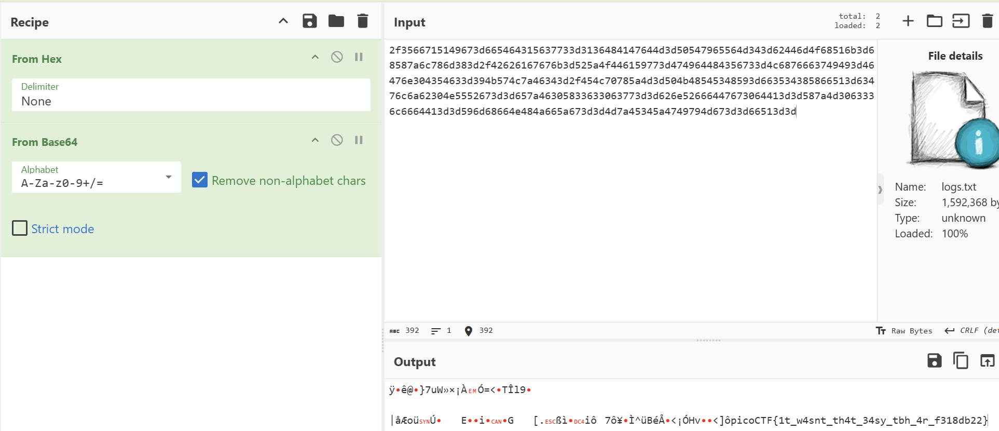

# Ph4nt0m 1ntrud3r(幽灵入侵者)

**题目描述**：一个数字幽灵突破了我的防御，我的敏感数据被盗了！😱💻 你的任务是找出这个幽灵入侵者是如何渗透我的系统的，并找回隐藏的标志。

要解决这个挑战，你需要分析提供的PCAP文件，并追踪攻击手法。攻击者巧妙地在合适的时机隐藏了他的动作。深入网络流量，应用正确的过滤器，展示你的取证能力，揭开这个数字入侵者的面纱！  
**工具**：Wireshark Cyberchef

拿到附件 pacp文件

用 **Wireshark** 打开

发现全是tcp协议 经过查询 没有导出对象 随便打开几个流量看看

发现每个报文在最后的8个字节都有base64

> 实际上就是Retransmitted TCP segment data (8 bytes)

这里试过直接按包序数提取base64 发现有内容但是位置有问题 大多是乱码

猜测是按时间戳顺序提取 **Cyberchef** 解密

取得flag flag为  
`picoCTF{1t_w4snt_th4t_34sy_tbh_4r_f318db22}`
