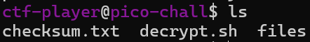
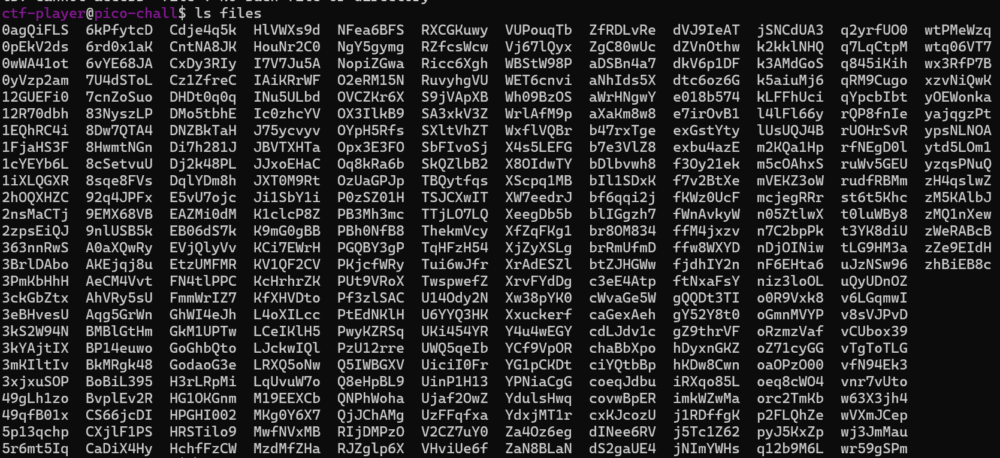
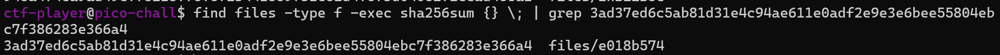
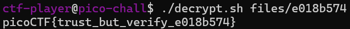

# Verify(验证)

**题目描述**：人们总是试图用仿冒的旗子来骗我的玩家。我想确保他们拿到真的！我打算提供 SHA-256 哈希和一个解密脚本，帮你确认我的旗子是真的。
Checksum(校验和):3ad37ed6c5ab81d31e4c94ae611e0adf2e9e3e6bee55804ebc7f386283e366a4
解密文件:验证 hash 通过后,运行 `./decrypt.sh files/<file>` 来解密。  
**工具**：ssh

先ssh连接 然后ls看一下



发现3个文件 txt内容就是哈希 sh文件就是解密脚本  
我们ls一下files



发现有很多文件 根据题目描述 我们要匹配sha256的值

```
find files -type f -exec sha256sum {} \; | grep 3ad37ed6c5ab81d31e4c94ae611e0adf2e9e3e6bee55804ebc7f386283e366a4
```



得到文件 是 e018b574 解密它



取得flag flag为  
`picoCTF{trust_but_verify_e018b574}`
