## stereo_secret

题目描述：
一台设备留下了一段双声道环境录音。单独播放左声道或右声道时，听到的都只是单调的设备噪声，但发送者特意保留了立体声结构。
flag格式：flag{}

听一下是摩斯密码 Audacity打开 发现有噪音  
直接看频谱图可以看到摩斯

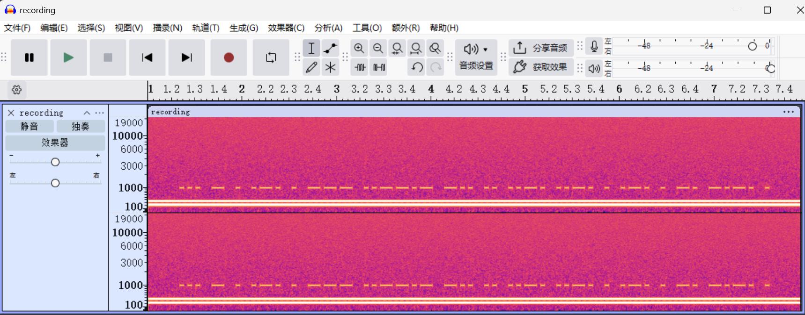

（题目意图应该是想提取声道反相再合并 不过看频谱图可以直接看出来）

摩斯密码扔进Cyberchef里解密 得到 `STEREO_DIFFERENCE`

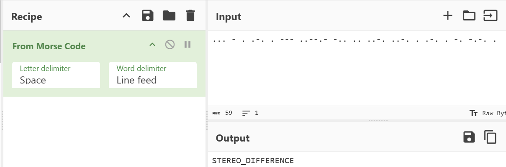

交了一下发现不对 最后发现是小写(淦)

## offline_vault

题目描述：调查人员获得了一份完全合成的Firefox ESR取证训练
profile。该用户曾登录一个离线保险箱PWA,并查看过一条
加密笔记。设备断网后,所有恢复工作都必须依靠浏览器本地
遗留数据。
flag格式: flag{}

拿到附件是Firefox Profile

login.json

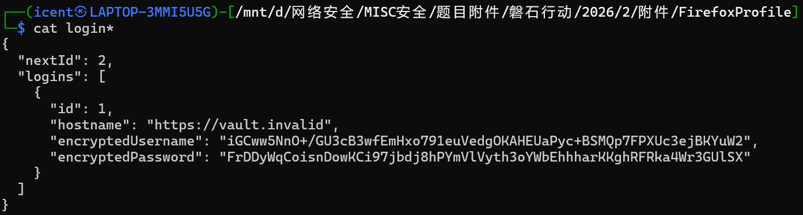

里面还有sqlite文件 可以用sqlitebowser查看  
key4.db

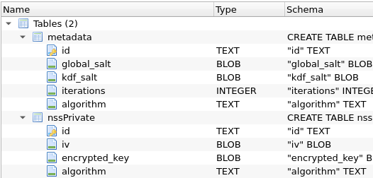

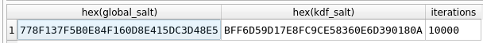

可以知道global_salt和kdf_salt 两者hex拼接得到salt

`778F137F5B0E84F160D8E415DC3D48E5BFF6D59D17E8FC9CE58360E6D390180A`

还可以知道加密算法是PBKDf2 迭代次数是10000

由此可以解出KEK 不知道为什么我本地的cyberchef跑不出来 只能在线版跑

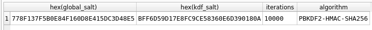

`ab737903f88127568db0656395351777afed69472305bf2ef271b0fdd3ee9bd4`

继续在key4.db找 能找到iv和密文encrypted_key 并且知道是AES

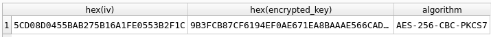

iv `5CD08D0455BAB275B16A1FE0553B2F1C`

encryptkey `9B3FCB87CF6194EF0AE671EA8BAAAE566CAD7D28FE1FAE9C51A854CFCC84768ADCC2C510B268CEE7BF4909F0137C681C`

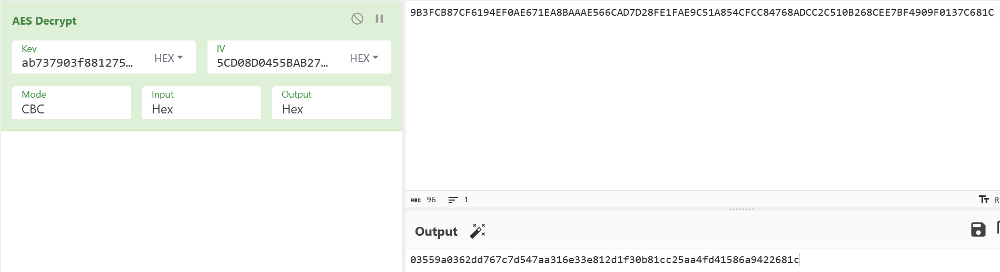

可以解出 `03559a0362dd767c7d547aa316e33e812d1f30b81cc25aa4fd41586a9422681c`

然后可以看login.json的数据了

```
"encryptedPassword": "FrDDyWqCoisnDowKCi97jbdj8hPYmVlVyth3oYWbEhhharKKghRFRka4Wr3GUlSX"
```

先 base64 然后取 hex

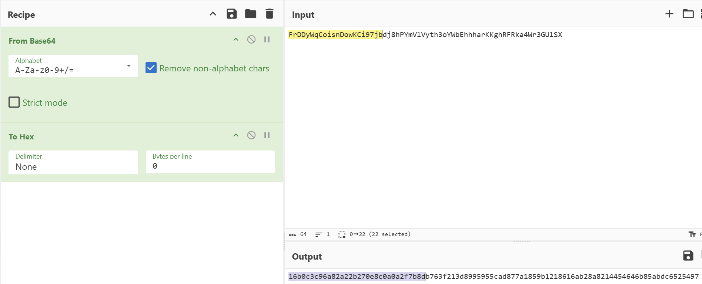

前16字节是iv（也就是32个字符）  
`16b0c3c96a82a22b270e8c0a0a2f7b8d`

后面的是密文  
`b763f213d8995955cad877a1859b1218616ab28a8214454646b85abdc6525497`

继续aes解密

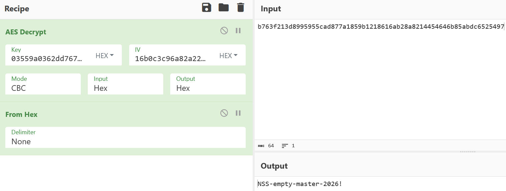

得到密码 `NSS-empty-master-2026!`

然后查 webappsstore.sqlite

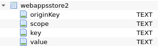

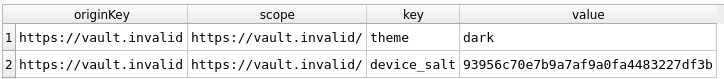

得到device_salt  
`93956c70e7b9a7af9a0fa4483227df3b`

然后看 cache2/entries/836...

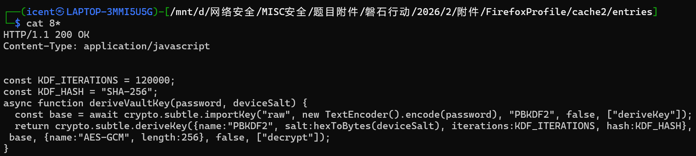

可以看到是SHA256 次数是120000

接着看 vault.sqlite

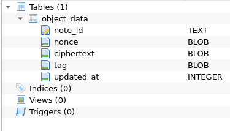

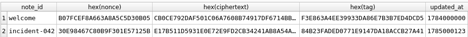

nonce  
`30E98467C80B9F301E57125B`

ciphertext  
`E17B511D5931E0E72E9FD2CB34241AB8A54A5EA1FEE70FAE57BA70627955FAEDA971EDDC7837`

tag  
`84B23FADED0771E9147DA18ACCB27A41`

pbkdf2解

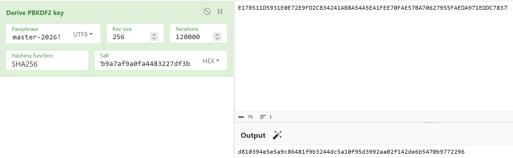

得到 `d810394e5e5a9c86481f9b3244dc5a10f95d3992aa02f142de6b5470b9772296`

aes-gcm解

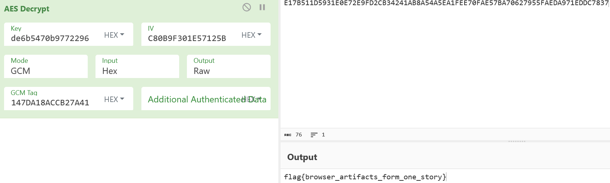
