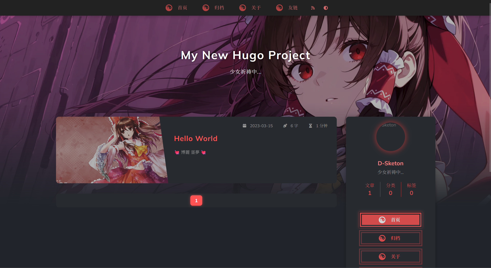
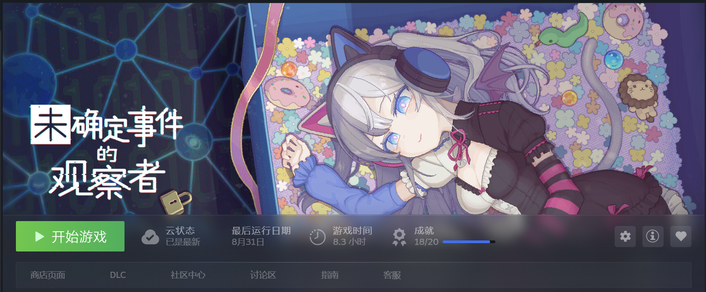
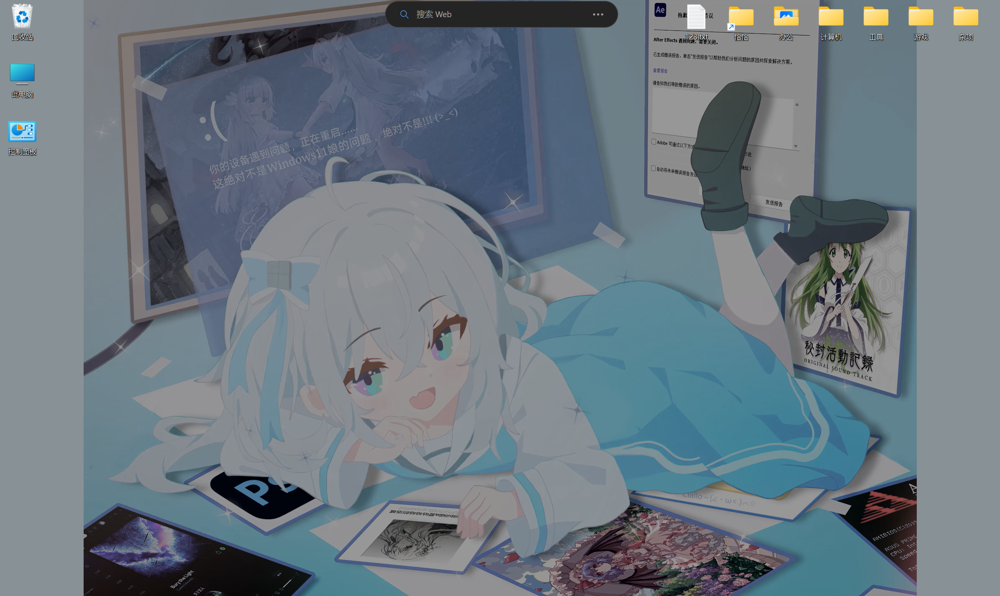

## 为什么要搞这个博客

其实在大一寒假的时候就有这个想法的 但是当时觉得学的东西太少 直接研究搭建博客需要的成本太高 于是就废弃掉了

后来大一下的时候其实搭过一个 使用了 **Hugo框架** 主题是灵梦的 但是我对Hugo的架构也不熟悉 想魔改主题对我来说太麻烦太难了 所以就没有上线（其实不魔改的话可以直接用 奈何我就是犟种）

大二上开学 jat哥说需要我们有个博客 看了下自己的白板博客园和“互联网风”CSDN 还是搞一个吧

> “互联网风”就是单纯吐槽CSDN页面广告太多 看着难受

巴特我是个懒人 域名和备案好像是有点费劲 所以想用github搞一个  
然后因为担心被打 我把网站搞成了静态的 并且应该会避免往这里放敏感信息

不过也因为是静态的 所以留言板和评论什么的就木大啦 不过也无所谓 毕竟除了我自己也没人在意这个博客吧（泪）

## 灵感来源

前段时间玩了一款解密游戏叫《未确定事件的观察者》  
玩法就像是开盒模拟器 在论坛上根据别人的发言关联其公开账号与私密账号 并推测其现实身份

某种意义上和我学的内容有点关联阿哇哈哈 我也喜欢开盒别人（bushi） 喜欢找一个人的关联账号  
然后这个游戏的美术很吸引我 主要是布局 在模拟一个电脑桌面  
这种布局的游戏其实玩过不少 比如NORI的网页解密 还有一个兔子玩具的 具体名字忘掉了

并且 我平时的桌面习惯就是放很多文件夹 感觉这样找东西比较快（实际上还是一坨shi山）

**我觉得 按电脑桌面与文件夹的方式展示文章是不是很有意思**

## 动起来动起来

于是我找了很多框架与它们的主题 发现并没有我想要的风格  
不过现在的ai已经够强了 于是我让它vibe了一个这样风格的网页 至少视觉上看着不错  
功能性上感觉是不如现存的那些强健的框架与插件 但是好看是第一生产力（嗯对

插图上选择了《魔法少女的魔女裁判》 没什么特别的原因 单纯喜欢这个ip 就像我的头像是saya一样  
硬说的话就是这个游戏的美术太好看了嗯我沉沦了

博客的一切操作都在仿照电脑桌面 你可以打开窗口 拖拽窗口 放大/缩小窗口 打开多个窗口  
然后深色模式和浅色模式的切换也是有的 点击艾玛桑/希罗酱就可以了  
阅读体验感觉只能说及格线吧 为了好看感觉舍弃了点可读性（果咩）  
说不定之后会加把窗口拖出来开一个新网页的功能呢？ 当然肯定是有生之年

侧边栏的 **“灵感”** 这个窗口是刚开始做的时候ai顺手生成的 然后我让它重构上传文章的方式的时候这块报废掉了（。。。  
还没修 倒是其实不打算修成原样子 正在深度思考中... 改成什么样子比较好

很多文章的上线时间是统一的 因为我没设置（偷懒） 有时间把每个文章的基本信息完善一下（立flag＋有生之年）

总而言之 玩的开心 欢迎驻足 来一段神秘字符串

ZmxhZ3tXM2xjMG0zXzcwX215X0J‍​​​​​​​​​‌‌​​‌‌​​​​​​​​​​‌‌​‌‌​​​​​​​​​​​‌‌​​​​‌​​​​​​​​​‌‌​​‌‌‌​​​​​​​​​‌‌‌‌​‌‌​​​​​​​​​​‌‌​​​​​​​​​​​​​‌‌​‌​​​​​​​​​​​​​‌​​​​‌​​​​​​​​​‌​‌‌‌‌‌​​​​​​​​​​‌‌​‌‌‌​​​​​​​​​‌‌​‌​​​​​​​​​​​​​‌‌​​​‌​​​​​​​​​​‌‌​‌​‌​​​​​​​​​‌​‌‌‌‌‌​​​​​​​​​​‌‌​​​‌​​​​​​​​​​‌‌​‌​‌​​​​​​​​​‌​‌‌‌‌‌​​​​​​​​​​‌‌​​‌‌​​​​​​​​​‌‌​​‌‌‌​​​​​​​​​‌‌​​‌‌‌​​​​​​​​​​‌​​​​‌​​​​​​​​​‌‌‌‌‌​‌sMGd9​​​​​​​​​​​​​​​​​​​​​​
